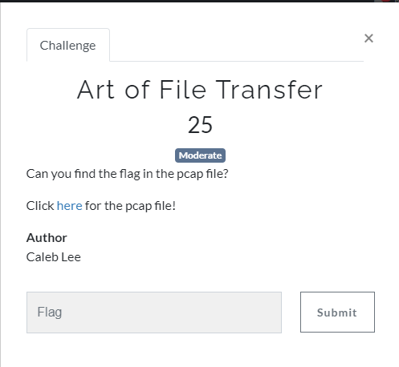
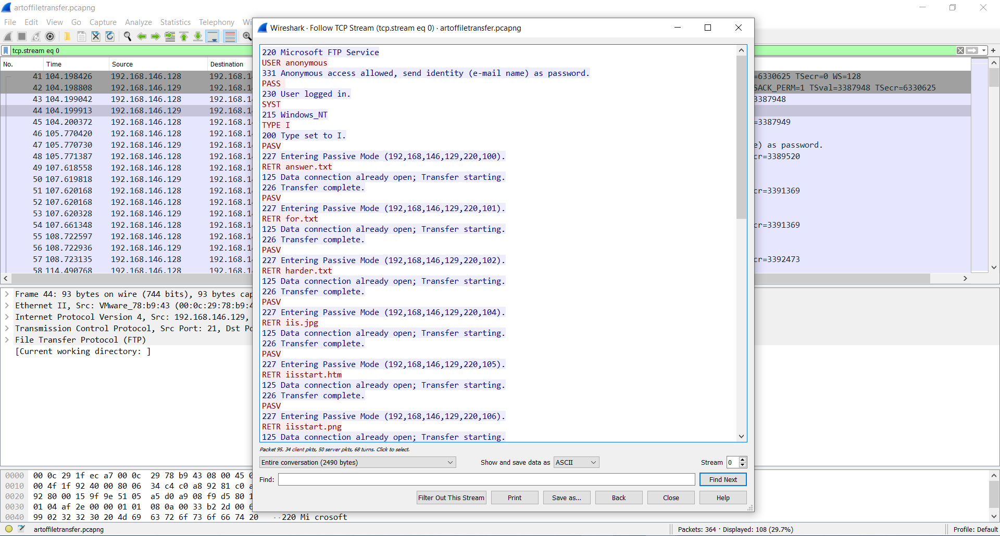
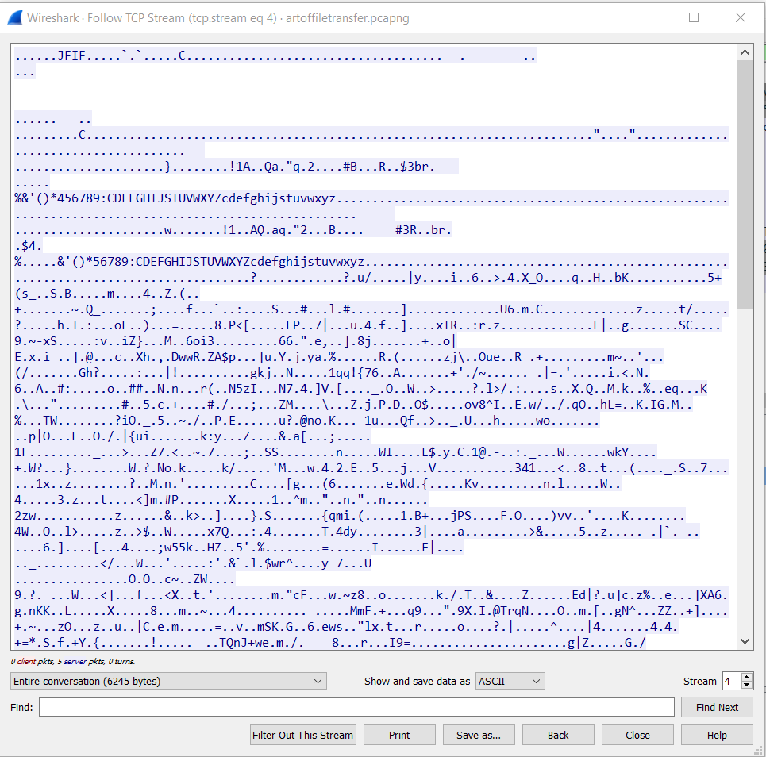
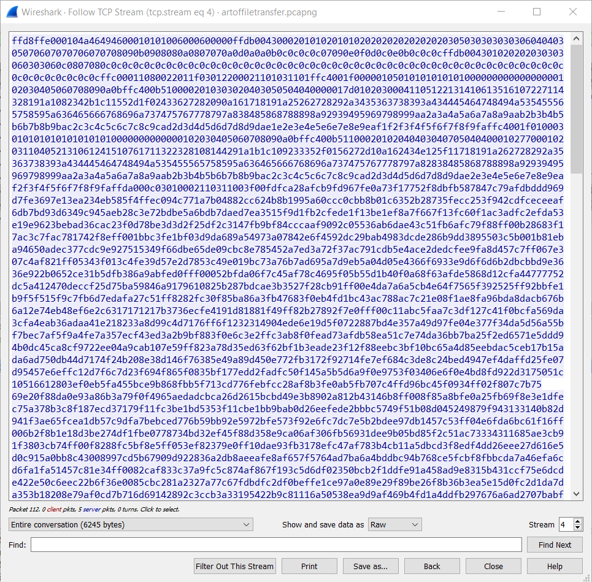
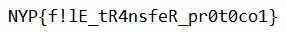

## Art of File Transfer

* [pcap file](./artoffiletransfer.pcapng)

o	Step 1 : Follow the TCP Stream

o	Step 2: Go to tcp stream 4

o	Step 3: Show and save data as Raw

o	Step 4: Save it as a file with .JFIF 

**Flag**

