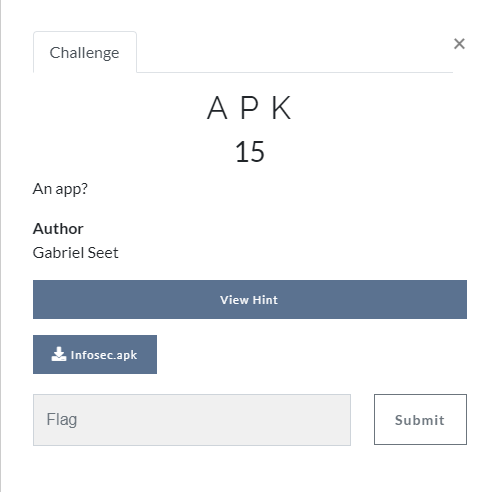
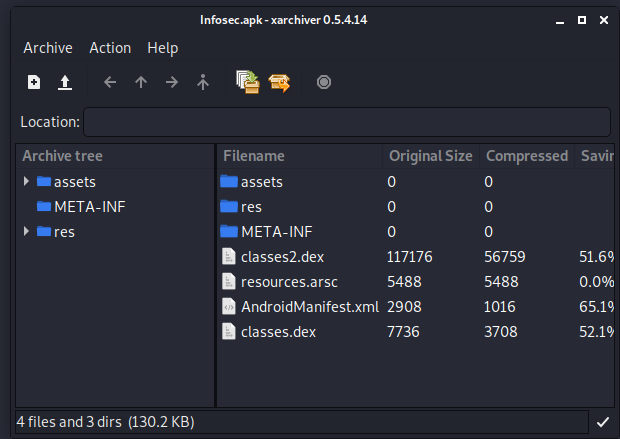

## Challenges
1. APK
2. SHA256()

## APK

* [apk file](./APK/Infosec.apk)

o	Step 1 : Extract files from apk

**Flag**
o	Step 2: under assets > www > img, there is a banner.png which is the flag

## SHA256()
/challenge.png)

o	Step 1 : Go to the URL

/1.png)

o	Step 2: View the page source
	In the page source there is this js function And a lot of links to images
/2.png)
/3.png)

o	Step 3:from the js function, if the login is successful, it will display image 161

o	Step 4: opening image 161, we get the flag

/aasSGDFGHFFtdsgdfhsghdffgDFHHsdhdfsghdgggSGDSGGSgj.png)
