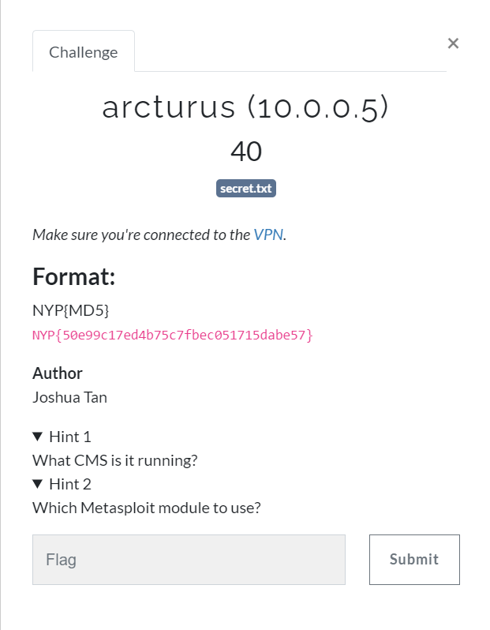
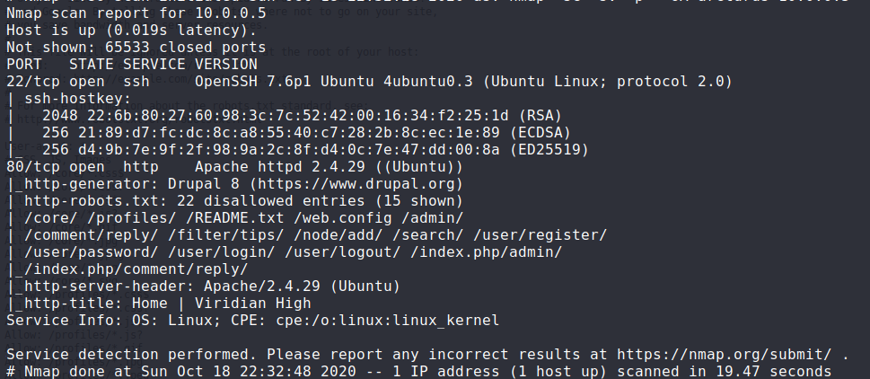
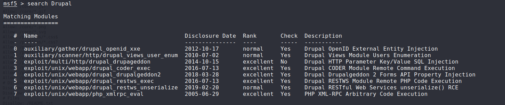
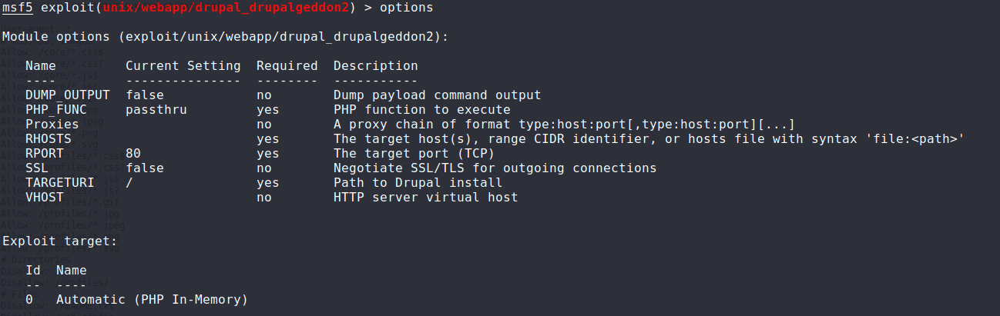
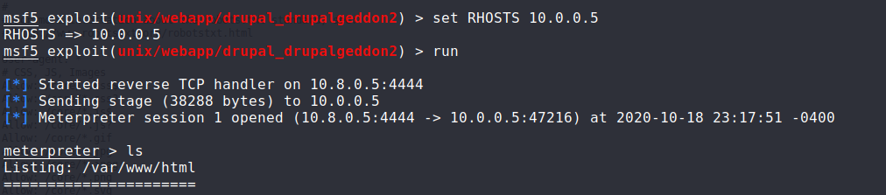
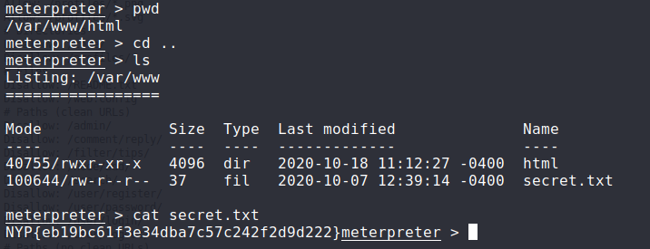

## Challenges
1. bellatrix (10.0.0.7)
2. capella (10.0.0.9)
3. arcturus (10.0.0.5)
4. atlas (10.0.0.6)
5. canopus (10.0.0.8)
6. deneb (10.0.0.10)

## arcturus (10.0.0.5)

o	Step 1: use nmap scan for open ports
 

o	Step 2: start Metasploit and check for Drupal vulnerabilities

o	Step 3: use exploit/unix/webapp/drupal_drupalgeddon2  

o	Step 4: Set the RHOSTS and run the exploit to get a meterpreter shell

o	Step 5: navigate the file system to find the secret.txt and get the flag

