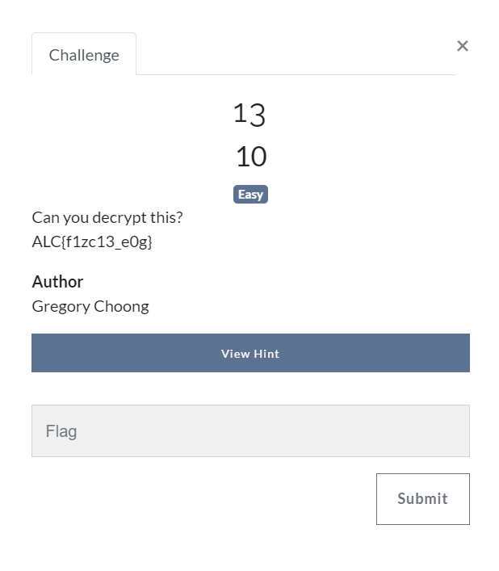
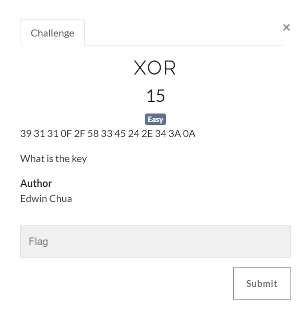
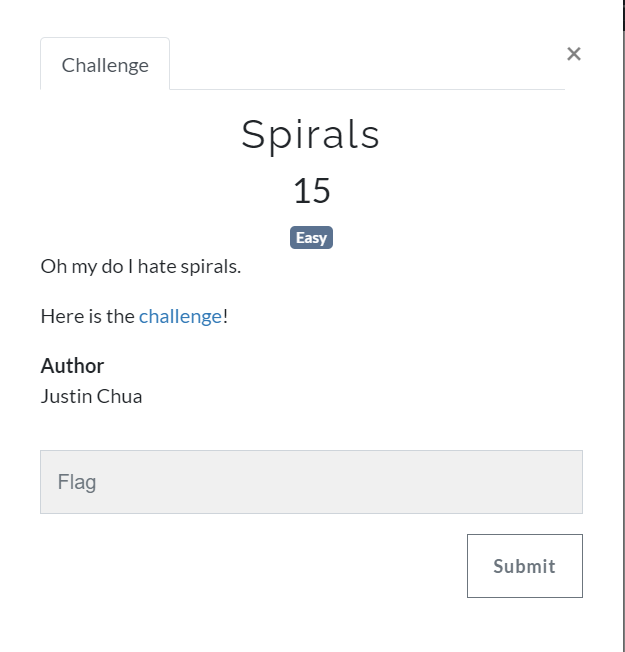

## Challenges
1. 13
2. Caesar Salad
3. Breadth Of the Wild
4. ZIG ZAG
5. Black and White
6. Beep Beep Beep dun
7. SIng a Song
8. XOR
9. Spirals
10. What the JS !!!
11. Dancing Men
12. Cryptomix

## 13


o	Step 1 : use [https://rot13.com/](https://rot13.com/) to get the flag

```
from ALC{f1zc13_e0g} to NYP{s1mp13_r0t}
```

## Caesar Salad


o	Step 1 : use [https://cryptii.com/pipes/caesar-cipher](https://cryptii.com/pipes/caesar-cipher) with key of 3 

```
from LORYHWRHDWFDHVDUVDODG to ILOVETOEATCAESARSALAD
```


## Breath Of The Wild


Symbols


o	Step 1 : use [https://www.dcode.fr/hylian-language-breath-of-the-wild](https://www.dcode.fr/hylian-language-breath-of-the-wild)


## ZIG ZAG


o	Step 1 : use [https://www.dcode.fr/rail-fence-cipher](https://www.dcode.fr/rail-fence-cipher), with keep punctuation and spaces checkbox checked

```
from NZZY{I_A}PGG to NYP{ZIG_ZAG}
```


## Black and White


this


o	Step 1 : Reverse the QR Code Colour and Scan it 


## Beep Beep Beep dun


[this](./Beep%20Beep%20Beep%20dun/bts_ctf.wav)

o	Step 1 : https://morsecode.world/international/decoder/audio-decoder-adaptive.html


## Sing A Song


[challenge](./Sing%20A%20Song/Challenge.txt)

o	Step 1 : use [https://www.dcode.fr/bacon-cipher](https://www.dcode.fr/bacon-cipher)


## XOR


o	Step 1 : use [https://www.dcode.fr/xor-cipher](https://www.dcode.fr/xor-cipher) with WHAT as the key

```
from 39 31 31 0F 2F 58 33 45 24 2E 34 3A 0A to NYP{X0R1SFUN}
```


## Spirals


[spiral.png](./Spirals/spiral.png)

o	Step 1 : Since we know the format of the first 3 character of NYP{, just follow Spiral orders and get the flag


## What the JS !!!


[challenge.txt](./What%20the%20JS!!!/challenge.txt)

o	Step 1 : It is JSFuck so we will use [http://codertab.com/JsUnFuck](http://codertab.com/JsUnFuck) to obtain the flag
or
o	Step 1 : Just run it in the console window


```
flag: NYP{JAVASCR!PT0BFUSCAT3}
```


## Dancing Men


[this](./Dancing%20Men/what_the.png)

o	Step 1 : Use [https://www.dcode.fr/dancing-men-cipher](https://www.dcode.fr/dancing-men-cipher)


## Cryptomix
```
unsolved
```


[message.txt](..mix/message.txt)

[key.txt](..mix/key.txt)

[info.txt](..mix/info.txt)

[final.txt](..mix/final.txt)

