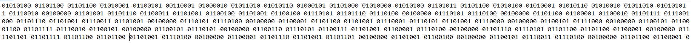
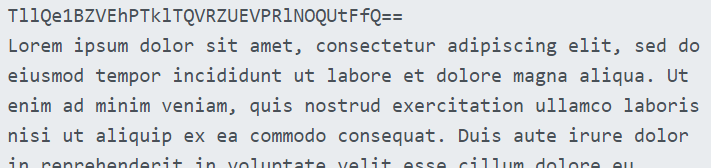
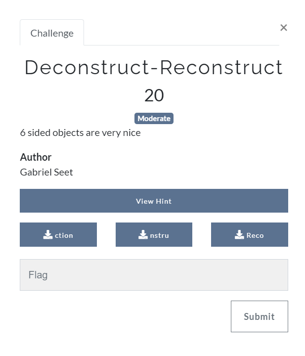
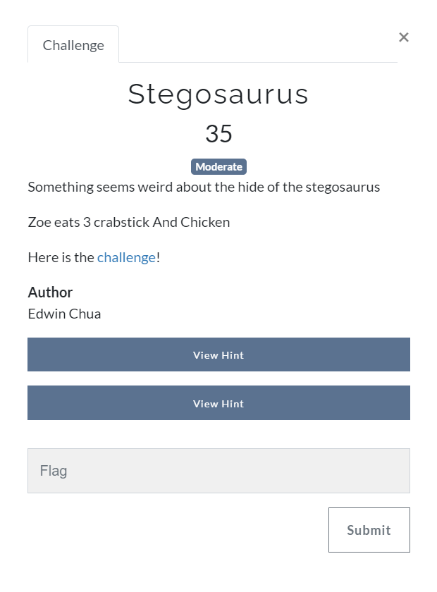
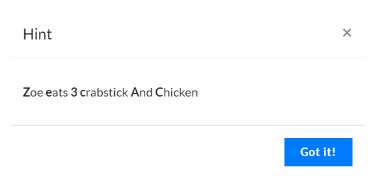
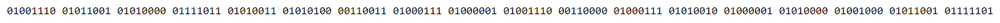

## Challenges
1. Hidden Image
2. Blank Excel
3. The hardest challenge
4. Mysterious Picture
5. There are plenty of flags
6. The answer
7. Snake
8. Deconstruct-Reconstruct
9. Don’t Scan Me
10. Musically Inclined
11. Stegosaurus
12. get pawn-ed
13. What’s my Password

## Hidden Image


[Hidden.jpg](./Hidden%20Image/Hidden.jpg)


o	Step 1 : Change file type of hidden.png to txt and do a quick search command 


```
flag: NYP{RED_PANDA}
```


## Blank Excel


[challenge.xlsx](./Blank%20Excel/challenge.xlsx)


o	Step 1 : Find the hidden sheet in challenge.xlsx which contain the flag by using the “unhide” option


```
flag: NYP{HIDDEN_CELL}
```


## The hardest challenge


o	Step 1 : Complete survey provided by NYP Infosec


## Mysterious Picture


[challenge](./Mysterious%20Picture/backtoschool.jpg)

o	Step 1 : Change file type of backtoschool.png to txt and do a quick search command 


```
flag: NYP{yay_back_t0_sch00l}
```


## There are plenty of flags


o	Step 1 : Flag Semaphore


## The answer


[The answer.zip](./The%20answer/The%20Answer.zip)

o	Step 1 : Extract The Answer.zip and run this command on linux to get the flag
```
grep -rnw '/path_of_zip/' -e 'NYP{'
```

## Snake


[Snake.exe](./Snake/Snake.exe)

o	Step 1 : Change the filetype of Snake.exe to text file 



o	Step 2 : Convert the binary to ASCII/UTF-8 character on a online converter and you will see a base64 encoded string on the header



o	Step 3 : Decode the base64 character for the flag
```
flag: NYP{PYTHONISATYPEOFSNAKE}
```


## Deconstruct-Reconstruct
```
unsolved
```


[Reco](./Deconstruct-Reconstruct/Reco)
[nstru](./Deconstruct-Reconstruct/nstru)
[ction](./Deconstruct-Reconstruct/ction)


## Dont Scan Me


o	Step 1 : Check the metadata of Don’t Scan Me.png on [www.metadata2go.com](www.metadata2go.com)


```
flag: NYP{EXIF_DATA}
```


## Musically Inclined


o	Step 1 : Decode it on [https://www.dcode.fr/music-sheet-cipher](https://www.dcode.fr/music-sheet-cipher) with the character on  BTS_MusicallyInclined.png


```
flag: NYP{YOUAREMUSICALLYTALENTED}
```


## Stegosaurus





o	Step 1 : Go to [https://futureboy.us/stegano/decinput.html](https://futureboy.us/stegano/decinput.html)

o	Step 2 : Find the password by taking the first character of each word from the Hint

o	Step 3 : Select Stego.jpg and enter Password as Ze3cAC
 


o	Step 4 : Convert the binaries to ASCII/UTF-8 for the flag 
```
flag: NYP{ST3GAN0GRAPHY}
```

## get pawn-ed
```
unsolved
```


## What's my Password?


[secret.zip](./What's%20my%20Password/secret.zip)

o	Step 1 : Brute force the zip file by using rockyou.txt and frcrackzip to find the password
```
fcrackzip -v -u -D -p rockyou.txt secret.zip
```
