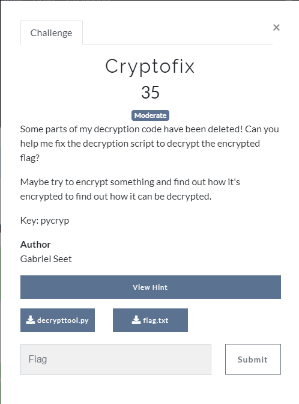
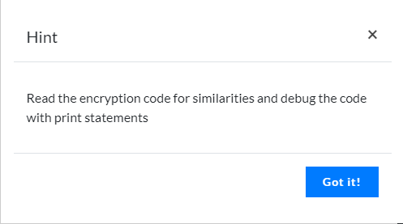

## Challenges
1. The Bug Err
2. Cryptofix
3. Scripto Crypto

## The Bug Err


[flaggen.py](./The%20Bug%20Err/flaggen.png)


o	Step 1 : Ensure the if else statement work so that the program works normally


to


o	Step 2 : Run and Test with Debugger on and you can see that the output is obviously not the flag


o	Step 3 : Now I look at the debugger and realize there is another list call k3ys 


o	Step 4 : Then, I start debugging the code start by fixing the creation of the combinedflag and run the code and realize the output is still not the flag


to


o	Step 5 : Then, I replace the current list with the new list found in the debugger earlier on and run the program again and now we found the flag


to


## Cryptofix
```
unsolved
```



[decrypttool.py](./Cryptofix/decrypttool.py)
[flag.txt](./Cryptofix/flag.txt)


## Scripto Crypto
```
unsolved
```


[script](./Scripto%20Crypto/canyougettheflag.py)
