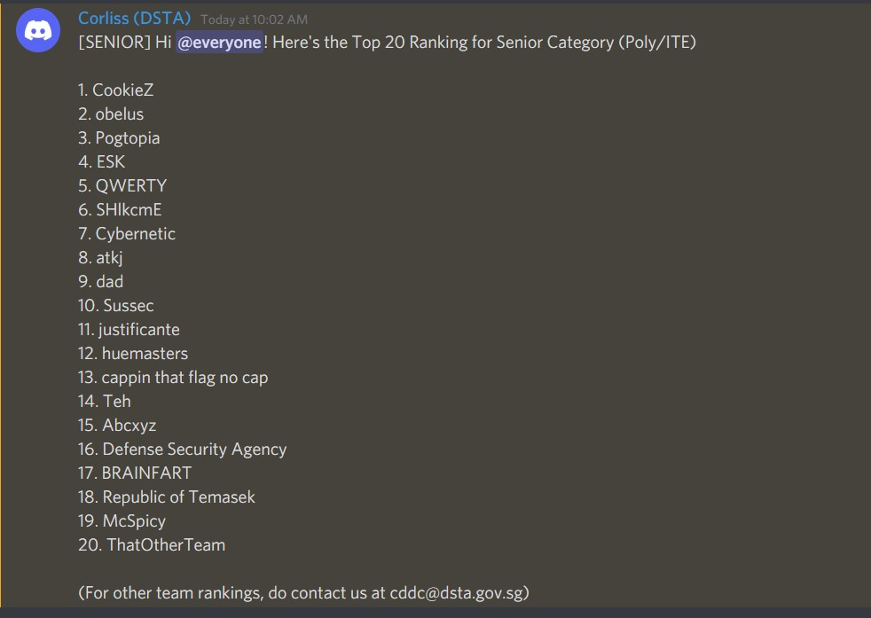
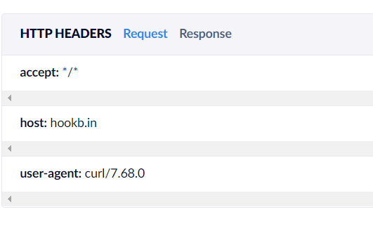
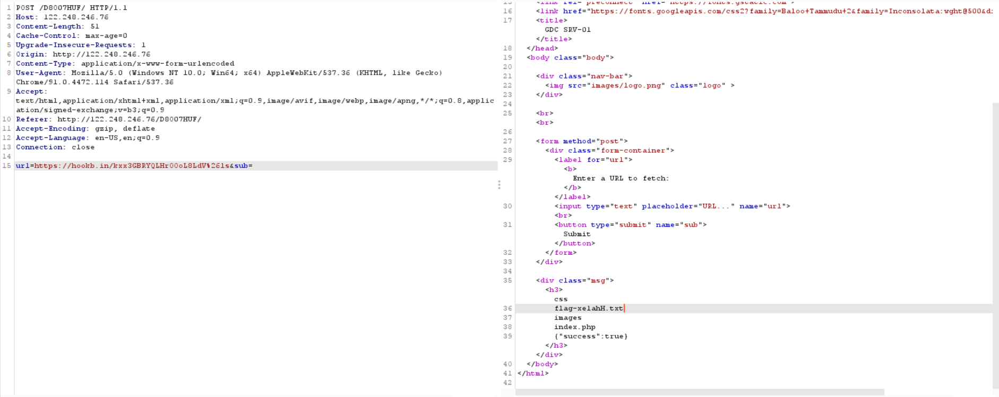
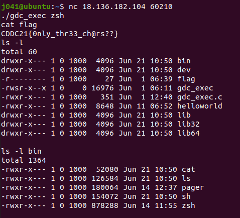
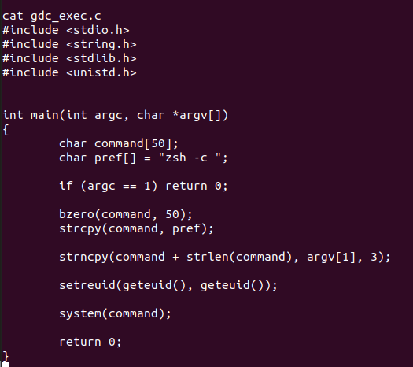
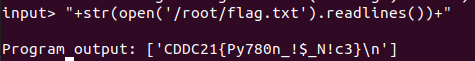
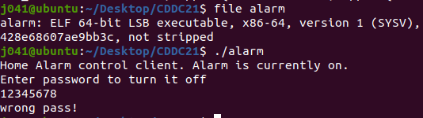
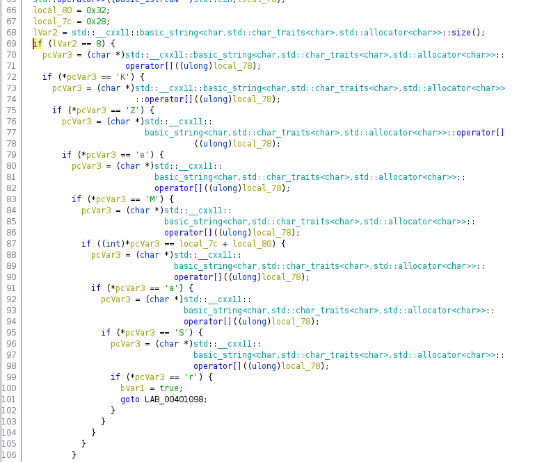
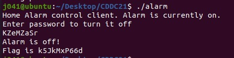

# CDDC-2021-Writeup

**Time**: 24 June 2021 10am - 25 June 2021 10pm [36 hrs]

### Team: Cybernetic

**Position:** 7th



---

# Web

## AccessKey

There is a secret.js file with 

```js 
var pass = unescape("unescape%28%22String.fromCharCode%252867%252C68%252C68%252C67%252C50%252C49%252C123%252C95%252C32%252C68%252C101%252C48%252C98%252C102%252C117%252C36%252C99%252C97%252C116%252C101%252C100%252C45%252C70%252C33%252C97%252C71%252C95%252C125%2529%22%29");
```
After Deobfuscation, we get 
```js
String.fromCharCode(67,68,68,67,50,49,123,95,32,68,101,48,98,102,117,36,99,97,116,101,100,45,70,33,97,71,95,125)
```
we can get the flag `CDDC21{_ De0bfu$cated-F!aG_}`

## GetURL

Creating a http bin url and sending it, We can see that it uses curl 



Adding `&ls` to the url parameter, We can list out the files



Going to http://122.248.246.76/D8O07HUF/flag-xe1ahH.txt
We get the flag `CDDC21{cMd_1Nj3Ct}`


# Pwn

## Length matters

Running `.gdc_exec zsh` and `cat flag.txt`, we can get the flag `CDDC21{0nly_thr33_ch@rs??}`



Source code of gdc_exec



## POP IT

Entering `"+str(open('/root/flag.txt').readlines())+"`. we can get the flag `CDDC21{Py780n_!$_N!c3}`



# RE

## Alarm

Running `file` on the binary shows us that its a 64 bit ELF executable. Running the binary, it asks us for a password.



Loading the binary into ghidra and looking at the main function, we can see the logic of the binary



From the decompiler, we can tell that the password is `KZeM` and `local_7c + local_80` and `aSr`. Since local_7c is 0x28 and local_80 is 0x32, adding them gives us 0x5A which is converted to `Z` Combining them, we get `KZeMZaSr` as the password



Entering the password, we get the flag `CDDC21{k5JkMxP66d}`