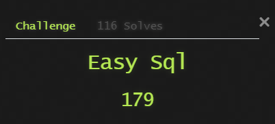
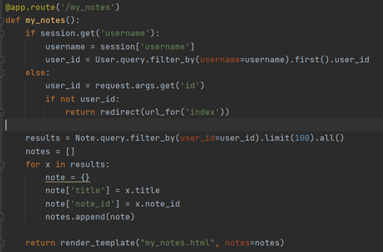

# DSO-NUS CTF
27/2/2021 DSO-NUS Capture The Flag Competition Write-up

This is a collection of my writeups for challenges solved during the CTF

CTF Hosted by DSO National Laboratories and NUS Computing

**Details**
__Playtime__
- 27/2/2021 09:00AM - 28/2/2021 09:00PM

**Write-up**
Done by 
* [Joel](https://github.com/j041)
* [Dylan](https://github.com/Dylan-Liew)

**Results**
- Position : 39/331

***
# Table of Contents
- [DSO-NUS CTF](#dso-nus-ctf)
- [Table of Contents](#table-of-contents)
- [Pwn](#pwn)
  - [insecure](#insecure)
- [Web](#web)
  - [Easy SQL](#easy-sql)
  - [babyNote](#babynote)
- [Mobile](#mobile)
  - [Login](#login)
  
***
# Pwn

## insecure

Download the file below.
[insecure](./assets/insecure)

Decompiling the insecure binary in ghidra shows that the binary calls the command “id” using the system.

The binary does not specify the full path to the id binary, this means that the id binary is searched for in the PATH variable. 

Connecting to the server with nc and test to see if it is possible to write a file to the server and execute it as well as view the configured environment variable

The PATH environment variable is used to determine in which directories the executable should be searched. The PATH variable is set to the bin directory.

listing the files shows the flag.txt while listing the files in the bin directory shows the id binary

Running `“echo "/bin/cat /flag.txt" > /tmp/id; chmod 777 /tmp/id; export PATH=/tmp:$PATH” and “/bin/insecure“` gave us the flag

| Command                              |                                                       |
|--------------------------------------|-------------------------------------------------------|
| echo "/bin/cat /flag.txt" > /tmp/id; | adding a file in tmp directory that will cat flag.txt |
| chmod 777 /tmp/id;                   | make the file executable                              |
| export PATH=/tmp:$PATH               | set PATH environment variable to tmp directory        |
| /bin/insecure                        | run the insecure binary                               |

***
# Web

## Easy SQL

As the title says, it is an sql injection challenge so my first attempt is to do a simple sql injection on the only input field to see the output.

Apparently, none of this information are related to the flag so i try further sql injection using `1’ union select 1`,databases()#  to attempt to find more information on the sql database however the output shows the following.

So this __return preg_match("/set|prepare|rename|alter|select|update|delete|drop|insert|where|\./i",$inject);__ regex search actually prevents me from entering any of this string. Next, I just Google search this statement to find if there is any information regarding the output and I found this chinese website https://blog.csdn.net/TM_1024/article/details/105730558 which is the writeup of a ctf challenge that is similar to this challenge where the different is that EasySQL prevent more sql statement such as rename which is used as one of the solution in the writeup above. Next, by following the writeup - 1';show tables# to retrieve the tables and found that there are two table “words” and “1919810931114514”  which is exactly the same as the writeup. Since more sql statement is being blocked from using, the only solution that is applicable in the writeup is using the handler and with the following payload given in the writeup - `` 1';handler `1919810931114514` open;handler `1919810931114514` read first#``

## babyNote

Download the file below.
[app.py](./assets/app.py)

After creating a note with a unique username, the navbar changes and more routes appear in the navbar where one of them is **/flag** where it shows that only localhost can get the flag thus we probably need to make the server think that it is requesting for the flag. My first thought is that this localhost might be the username but after verifying with the admins, they say that this localhost means the actual “localhost”.

Before actually solving the challenge, there is other test that was completed where (SSTI) server-side template injection is tested by using {{ 7 * 7 }} on the username or other form input. However, it does not seem to be vulnerable to SSTI.
Next, I also find out that the /my_notes route has a vulnerability at which users are able to pass the “id” parameters into the url on this page if no username found in the cookie or no cookie is found in the session.

After some googling, we found this writeup from starctf2021 https://github.com/sixstars/starctf2021/blob/main/web-oh-my-note/oh-my-note-EN.md

Using the python script from the writeup, we get **7bdeij4oiafjdypqyrl2znwk7w9lulgn** value
 

Python script:

Using **id=7bdeij4oiafjdypqyrl2znwk7w9lulgn** and without a session cookie, we can access the admins notes

In the **oh!oh!oh!My secretz?** note, it states that there is a secret URI endpoint **/y0u_n3v3r_gu3ss_1t/?url**

Going to **/y0u_n3v3r_gu3ss_1t/?url** shows the following where the url parameter takes in value

 
Using **?url=http://ctf-9ess.balancedcompo.site:22222/flag** shows that the server sends a GET request to the url and displays its contents

Using **?url=http://localhost/flag** shows that something went wrong at the backend
 

We Used **0.0.0.0** to replace localhost as 0.0.0.0 represents all IPv4 addresses on the machine. Sending **?url=http://0.0.0.0/flag** returns the /flag page with an extra “server_side_request_forgery_is_dangerous” in the output

The flag is the hash of “server_side_request_forgery_is_dangerous” : **DSO-NUS{fa8ae268a95476396bb304b7c154a49922b7fd69ae4dd201c79f28c07a2ca9e1}**

***
# Mobile

## Login

Firstly, I just run the apk on my android emulator and found that an username and password is needed and I assume with the correct input, I will just get the flag.

My first step into reverse engineering was to just simply open the apk using jadx-gui which is a GUI tool for producing Java source code from Android Dex and Apk files. I found this LoginDataSource model which actually does the username and password check.

 
So there are three if statement to check the user input where the first if statement is to check the str (username) with the value of hexStringToString("5573657231333337"), second if statement is to check the first 4 character of the str2 (password) with the return value of getJavaPassword() function and third if statement to check the rest of the character of str2 (password) with the return value of getNativePassword() function from native library.
For the first and second if else statement, I simply copy the function from the source code and run it to get the value. Username = User1337, First 4 character of password = L1v3

 
However for the getNativePassword(), I am quite unclear what to do with it so my first step is to extract the native library from the source code and open it with IDA for further analysis however, I couldn’t understand any of the assembly code so i went to research more on alternative way to get the value of the function.

So I went to Google for commonly used tools for reverse engineering of android app and I found this link https://www.andreafortuna.org/2019/07/18/reverse-engineering-and-penetration-testing-on-android-apps-my-own-list-of-tools/ and from this link, Objection tool caught my attention as it says that it is a runtime mobile exploration toolkit meaning I will be able to get the function value when the app is checking for the password at the third if statement. So I just simply search for an online guide to set up Objection.Then, I just patch the apk and install it on my android emulator after deleting the previous installed one to prevent errors.

Then I simply run the application again and the application does not seem to be responding. Oh! I need to run `objection explore` to start the objection exploration REPL to further progress.
Once it starts running, i just need to use the following command to watch the method getNativePassword() `android hooking watch class_method com.ctf.level1.data.LoginDataSource.getNativePassword --dump-args --dump-backtrace --dump-return`. Next, I simply enter the username and first 4 characters of the password found in order for the credential check to reach the third if statement to run the function.The return value of getNativePassword() is p2Zzw0rD.

Then, I would just need to enter the full credential where the username is User1337 and password is L1v3p2Zzw0rD and the flag is printed in the logcat.

