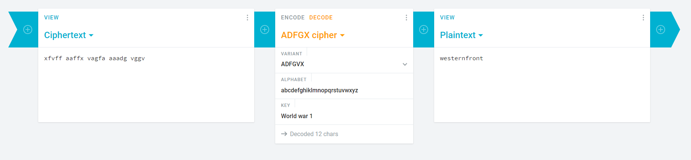
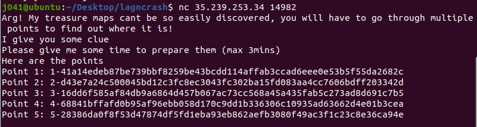

***
# Table of Contents
- [German Army](#German\ Army)
- [Pirate's Treasure](#Pirate's\ Treasure) 

***

### German Army

---

##### Challenge Description

Oh no the Germans are attacking our base. We have intercepted this: xfvff aaffx vagfa aaadg vggv

They mentioned something about: world war 1

Can you solve this it?

PSPS Take note after decryption, the output is NOT in flag format LNC{}. The final flag entered should be in all caps eg LNC{THIS_IS_THE_FLAG}.

---

The German Army used the ADFGX cipher in world war 1

Using an online decoder [https://cryptii.com/pipes/adfgvx-cipher](https://cryptii.com/pipes/adfgvx-cipher) and using `world war 1` as the key, we can get the plaintext `westernfront` and thus the flag `LNC{westernfront}`



***

### Pirate's Treasure

---

##### Challenge Description

Welcome to to the SSS Ship, We hid our treasure very clerverly I doubt you can find it. It is shared with our other pesky pirate. What? Why? Obviously I do not trust them but they only have one part of the map to the treasure.

What is treasure without some digging?

You just need to connect to the server one time.

nc 35.239.253.34 14982

---

After connecting to the server, we get 5 different values



`Point 1: 1-41a14edeb87be739bbf8259be43bcdd114affab3ccad6eee0e53b5f55da2682c`
`Point 2: 2-d43e7a24c500045bd12c3fc8ec3043fc302ba15fd083aa4cc7606bdff203342d`
`Point 3: 3-16dd6f585af84db9a6864d457b067ac73cc568a45a435fab5c273ad8d691c7b5`
`Point 4: 4-68841bffafd0b95af96ebb058d170c9dd1b336306c10935ad63662d4e01b3cea`
`Point 5: 5-28386da0f8f53d47874df5fd1eba93eb862aefb3080f49ac3f1c23c8e36ca94e`

Using [sharing.py](https://github.com/ExinOne/secret-sharing/blob/master/README.md) and editing the recover function

```python
def recover(args):
    min = args.min
    keyfile = args.keyfile

    parts = []
    for line in open(keyfile):
        parts.append(line.rstrip('\n'))

    result = PlaintextToHexSecretSharer.recover_secret
    print(result(parts))
    print("The full private key is: " + result.rstrip('\n'))
```

we can get the flag `LNC{@_Thr35hOlD_Crypt05y5tem5}`