***
# Table of Contents
- [Do you believe in Aliens?](#Do\ you\ believe\ in\ Aliens?)
- [Whitespaces](#Whitespaces)
- [Hush Dog](#Hush\ Dog)
- [Hidden Password](#Hidden\ Password)

***

### Do you believe in Aliens?

---

##### Challenge Description

I was just listening to my radio...until I caught a secret message sent from the great unknown!
Though I can't make sense of it...help?

[alien.wav](./Aliens/alien.wav)

---

Using an online Spectrum Analyzer [https://academo.org/demos/spectrum-analyzer/](https://academo.org/demos/spectrum-analyzer/) to play the wav file, we can get the flag `LNC{tr@sH_2iNt_It}`

***

### Whitespaces

---

##### Challenge Description

[txt](./whitespace/txt)

---

After opening the txt file, we see text followed by empty lines.
After removing the text, we get 'whitespace' which is actually made up of spaces and tabs

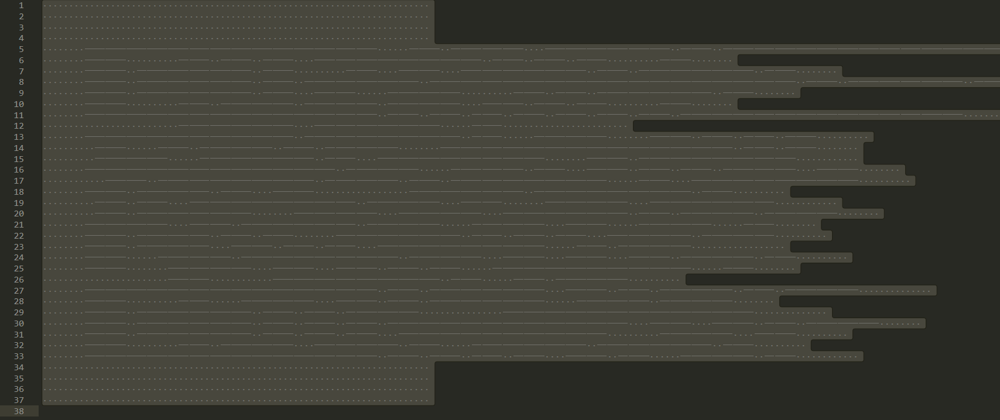

After Finding and replacing all the tabs with a number, we can see a QR code

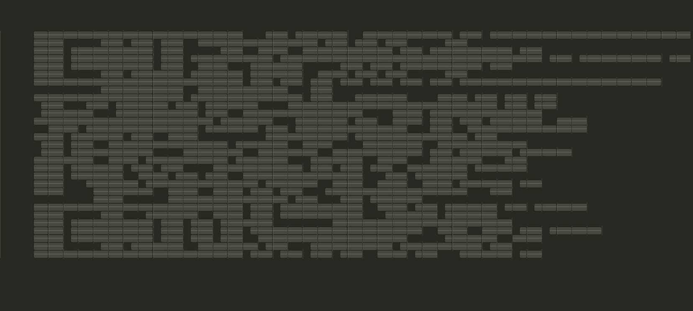
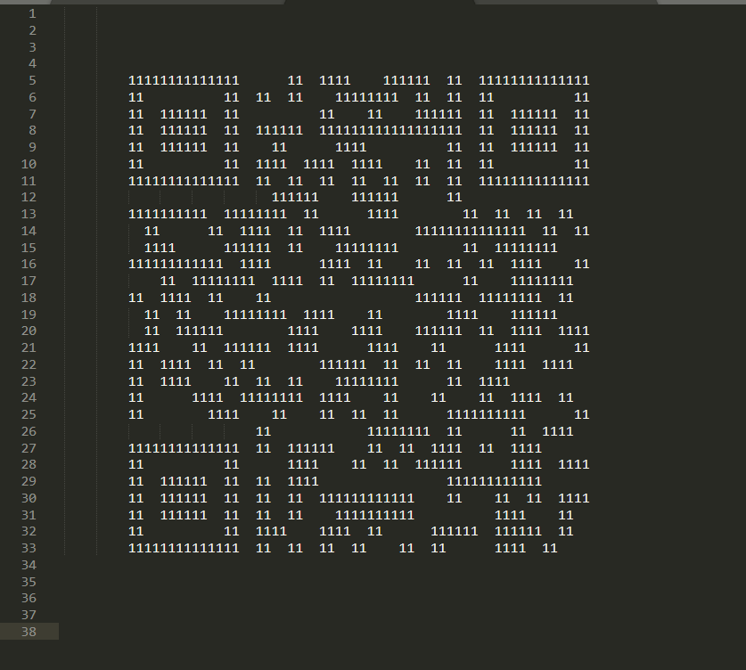

After scanning the QR code, we can get the flag

### Hush Dog

---

##### Challenge Description

Sam recently sent Tom a file Message.txt which I managed to get a hold on but encrypted. Fortunately, I have managed to capture the conversation between their machine during the time of sending the file.

Decrypt the ciphertext and submit the flag in LNC{…} format.

[message.txt](./hush_dog/message.txt)
[Something.pcapng](./hush_dog/Something.pcapng)

In Something.pcaping there is a GET request to /Sam_To_Tom.txt

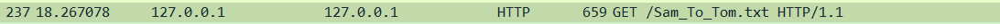

The contents of the file is
`W3sib3AiOiJUbyBCYXNlNjQiLCJhcmdzIjpbIk4tWkEtTW4temEtbTAtOSsvPSJdfSx7Im9wIjoiUkM0IiwiYXJncyI6W3sib3B0aW9uIjoiVVRGMTYiLCJzdHJpbmciOiJCb05wQVJ0ZSJ9LCJMYXRpbjEiLCJMYXRpbjEiXX0seyJvcCI6IlRvIEhleCIsImFyZ3MiOlsiU3BhY2UiXX0seyJvcCI6IkhleCB0byBQRU0iLCJhcmdzIjpbIkxldmVsIDIiXX0seyJvcCI6IlRvIEJhc2U2NCIsImFyZ3MiOlsiLi8wLTlBLVphLXo9Il19LHsib3AiOiJSQzQiLCJhcmdzIjpbeyJvcHRpb24iOiJVVEY4Iiwic3RyaW5nIjoibmFwb2xlb24ifSwiTGF0aW4xIiwiTGF0aW4xIl19LHsib3AiOiJUbyBIZXgiLCJhcmdzIjpbIlNwYWNlIl19LHsib3AiOiJIZXggdG8gUEVNIiwiYXJncyI6WyJMZXZlbCAxIl19LHsib3AiOiJUbyBIZXgiLCJhcmdzIjpbIk5vbmUiXX0seyJvcCI6IlRvIEJhc2U2NCIsImFyZ3MiOlsiQS1aYS16MC05Ky89Il19XQ==`

after base64 decoding it, we get
`[{"op":"To Base64","args":["N-ZA-Mn-za-m0-9+/="]},{"op":"RC4","args":[{"option":"UTF16","string":"BoNpARte"},"Latin1","Latin1"]},{"op":"To Hex","args":["Space"]},{"op":"Hex to PEM","args":["Level 2"]},{"op":"To Base64","args":["./0-9A-Za-z="]},{"op":"RC4","args":[{"option":"UTF8","string":"napoleon"},"Latin1","Latin1"]},{"op":"To Hex","args":["Space"]},{"op":"Hex to PEM","args":["Level 1"]},{"op":"To Hex","args":["None"]},{"op":"To Base64","args":["A-Za-z0-9+/="]}]`

After beautifying it we get
```json
[
   {
      "op":"To Base64",
      "args":[
         "N-ZA-Mn-za-m0-9+/="
      ]
   },
   {
      "op":"RC4",
      "args":[
         {
            "option":"UTF16",
            "string":"BoNpARte"
         },
         "Latin1",
         "Latin1"
      ]
   },
   {
      "op":"To Hex",
      "args":[
         "Space"
      ]
   },
   {
      "op":"Hex to PEM",
      "args":[
         "Level 2"
      ]
   },
   {
      "op":"To Base64",
      "args":[
         "./0-9A-Za-z="
      ]
   },
   {
      "op":"RC4",
      "args":[
         {
            "option":"UTF8",
            "string":"napoleon"
         },
         "Latin1",
         "Latin1"
      ]
   },
   {
      "op":"To Hex",
      "args":[
         "Space"
      ]
   },
   {
      "op":"Hex to PEM",
      "args":[
         "Level 1"
      ]
   },
   {
      "op":"To Hex",
      "args":[
         "None"
      ]
   },
   {
      "op":"To Base64",
      "args":[
         "A-Za-z0-9+/="
      ]
   }
]
```

After using the values from Sam_to_Tom.txt to decode message.txt, we can get the flag

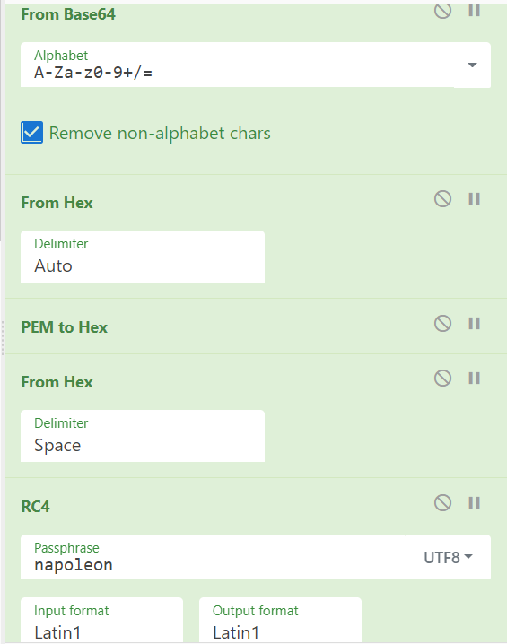
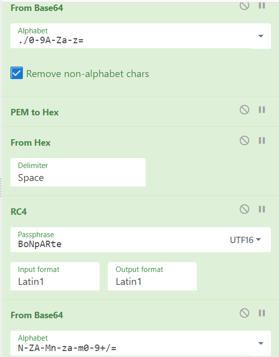

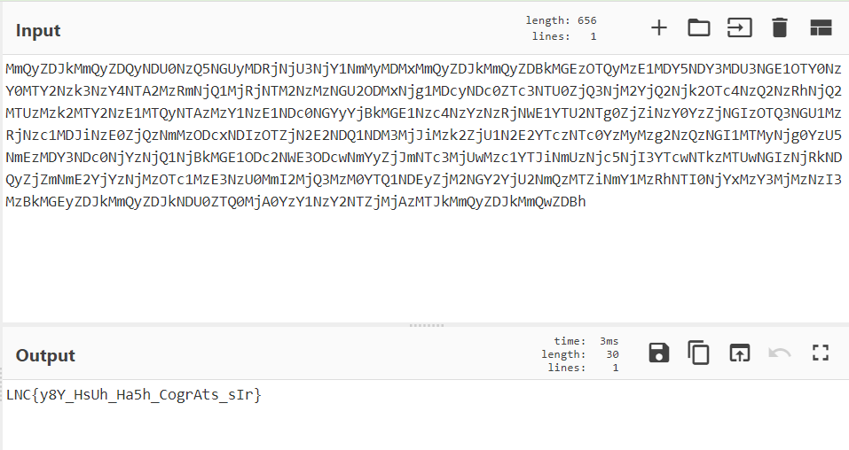

---

### Hidden Password

---

##### Challenge Description

The flag is in the zip… But I can’t figure out the password?

[flag.zip](./hidden_password/flag.zip)

---

After putting flag.zip into CyberChef, we can see `but there is a password
or is there?`

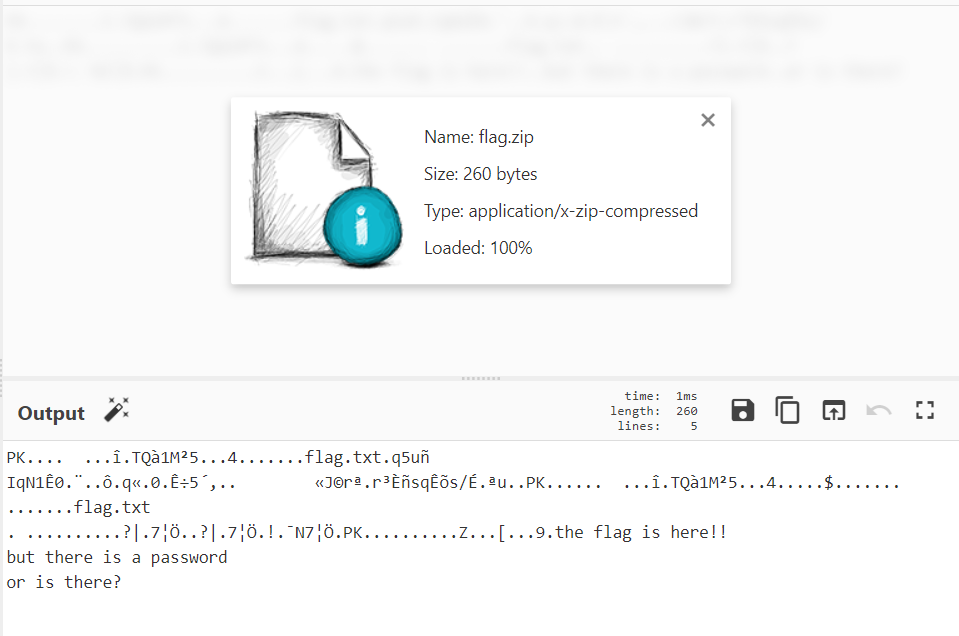

Using a hex editor, modify the encryption bit from 09 to 00 

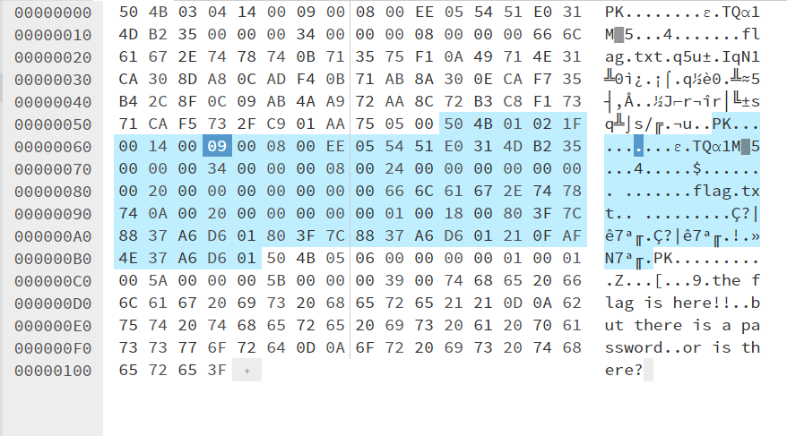
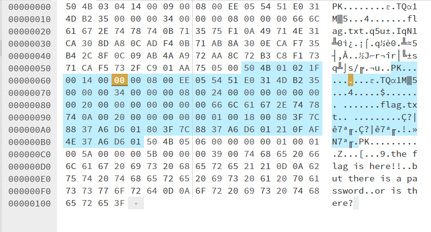

extracting the modified file will not prompt for a password and return `TE5DJTdCd2h5XyUyNTFzX3RoM19wYTVzdzByZF8lNDBmNGtlJTdE` in flag.txt

After decoding it, we can get the flag `LNC{why_%1s_th3_pa5sw0rd_@f4ke}`
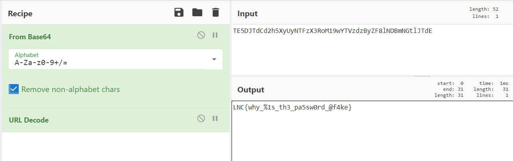
