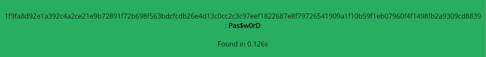
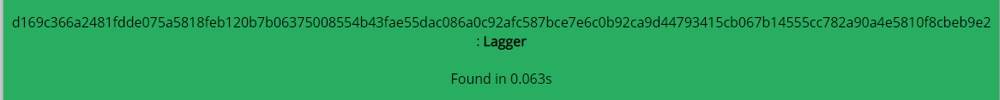
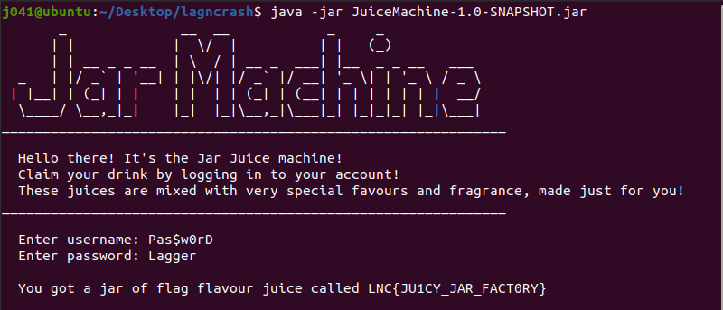

***
# Table of Contents
- [JuiceMachine](#JuiceMachine)

***

### JuiceMachine

---

##### Challenge Description

Want to get some flag flavored juice? Just login to the Juice Machine!

[JuiceMachine-1.0-SNAPSHOT.jar](./JuiceMachine/JuiceMachine-1.0-SNAPSHOT.jar)

---

Using an online java decompiler [http://www.javadecompilers.com/](http://www.javadecompilers.com/) and analyzing the output, we find that Username SHA 512 hash must be == 1f9fa8d92e1a392c4a2ce21e9b72891f72b698f563bdcfcdb26e4d13c0cc2c3c97eef1822687e8f79726541909a1f10b59f1eb07960f4f1498fb2a9309cd8839 and Password SHA 512 hash must be ==
d169c366a2481fdde075a5818feb120b7b06375008554b43fae55dac086a0c92afc587bce7e6c0b92ca9d44793415cb067b14555cc782a90a4e5810f8cbeb9e2

Using an online hash cracker [https://md5decrypt.net/en/Sha512/](https://md5decrypt.net/en/Sha512/), we find that username is `Pas$w0rD` and password is `Lagger`

After running the jar file `java -jar JuiceMachine-1.0-SNAPSHOT.jar`, it asks for the username and password. Inserting `Pas$w0rD` as the username and `Lagger` as the password, we get the flag. `LNC{JU1CY_JAR_FACT0RY}`

