# **Defcon Red Team village Quals CTF 2021**

<p align="center">
  

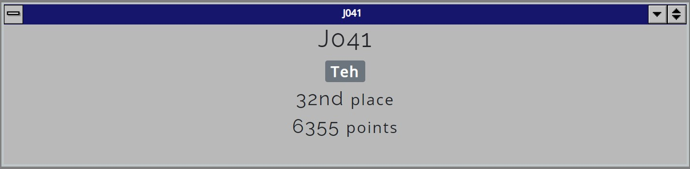

***
# Table of Contents

- [**Defcon Red Team village Quals CTF 2021**](#defcon-red-team-village-quals-ctf-2021)
- [Table of Contents](#table-of-contents)
- [network-forensics](#network-forensics)
  - [SNMP brute force 1 💪](#snmp-brute-force-1-)
  - [SNMP brute force 2 💪](#snmp-brute-force-2-)
  - [🏓](#)
- [cracking](#cracking)
  - [easy crack 1 - 10](#easy-crack-1---10)
  - [Medium crack 1 - 10](#medium-crack-1---10)
- [FLAGUSB](#flagusb)
  - [Look at What Wireshark Can Do!](#look-at-what-wireshark-can-do)
- [Quest](#quest)
  - [Quest 1](#quest-1)
  - [Quest 2](#quest-2)
- [strings](#strings)
  - [strings](#strings-1)
- [reversing](#reversing)
  - [Go get it](#go-get-it)
- [router-pwn 1 - 13](#router-pwn-1---13)
***
# network-forensics

## SNMP brute force 1 💪
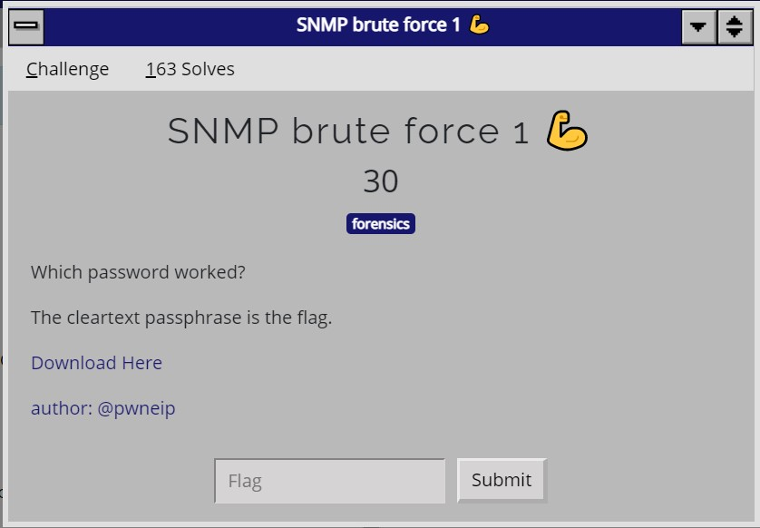

[Challenge pcap](assets/network-for/snmp-brute.pcap)

**Solution:** 
The password is the only value that is returned

## SNMP brute force 2 💪
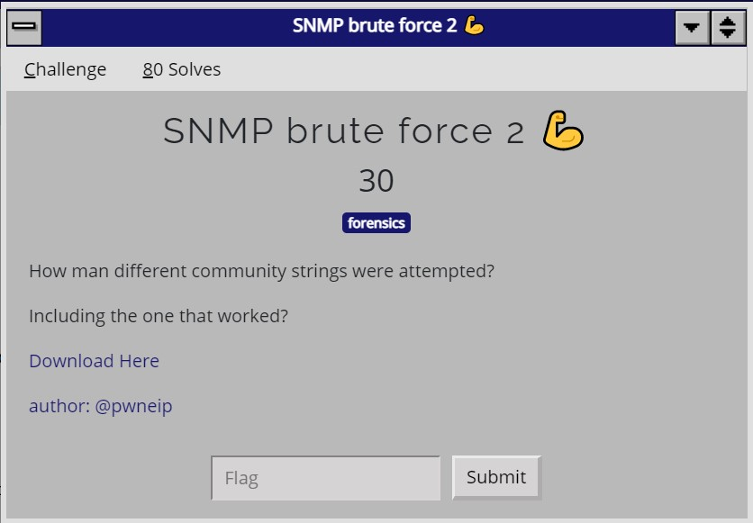

[Challenge pcap](assets/network-for/snmp-brute.pcap)

**Solution:** 

run `tshark -r snmp-brute.pcap -T fields -e snmp.community snmp.community | sort | uniq | wc -l` to get 206

Reference: https://unix.stackexchange.com/questions/28845/count-distinct-values-of-a-field-in-a-file

## 🏓
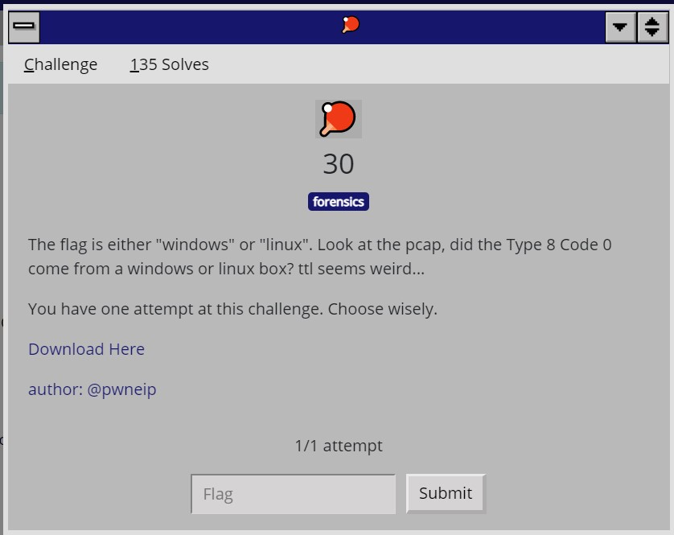

[Challenge pcap](assets/network-for/capture.ping)]

**linux**

**Solution:** 
Reference: https://www.howtogeek.com/104337/hacker-geek-os-fingerprinting-with-ttl-and-tcp-window-sizes/

In packet 6 & 9 , the ttl is 64 thus the flag is linux

***
# cracking

## easy crack 1 - 10

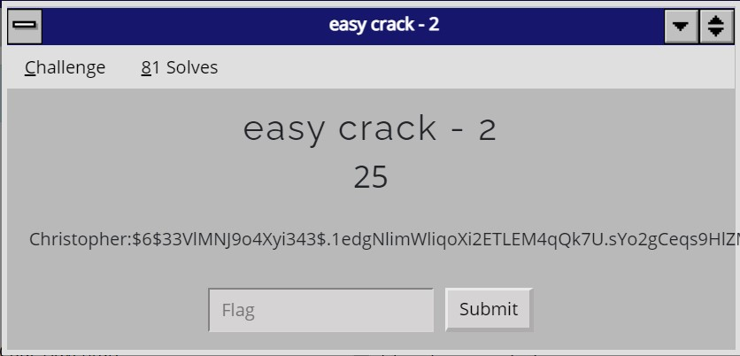

hashes to crack
```
* Latoya c880066b797bb43337dd14c098ec8c2b
* Christopher:$6$33VlMNJ9o4Xyi343$.1edgNlimWliqoXi2ETLEM4qQk7U.sYo2gCeqs9HlZMlvJGnibSP.BCw4cdpGUqE41Bxjp.fWI2iDKClGBxoR1
* Jessica:$6$qUX8cPJFtK0MIJqG$pFW1bnU4qaS8O9lv1gfsG3/CCa7F2SS12m5ivkrGVO7/Sqtd2/c.RR52d5WQ2461ZbTnOMh7zzGJoXZRO5/rP/
* Stephanie 31da012ca41a821fe15251714d241679
* Sean:$6$MPCZQ37FAGshRIep$W1lDSSonF8P080J/VmsS2QVsbkCGPVxcjomFiGTHsWrgS8wBOBWgYonUciXbpY/LmIxnKNX/j4lsuRFegZhFE0
* enable secret 5 $1$HeTF$r7S02AScNwFeBnzu3S4BD/
* enable secret 5 $1$5m2h$ZModH3IA/e4dfjQ2.2OwU.
* Bryan:$6$3DsqwQb7elYt4LYi$7EVcxN1EPJjBgxTjz1GBAfV3MjvX79dAZqvrXj8yIGxJbPK9u6Dda1z40FY0qzzNOU1/4FuX5BESGjXo0ysPS0
* Virginia:$6$5w.deEvVTlb5QRhy$A.Kg.uRv3iLh528SBuX2SW9C2HN9pzJh/Kx/9T9jXPk9qiOst4JmguRGV24G9lRIJ6XD9L6VcsElnVCP/xrOx.
* Karen:$5$HW0u4s43EAQD18vr$Aj.QXkCVSmAm3EJOFha5HHnmk0eT60u.gbJiFq2S0U7
```

**Solution:** 

Extract the hashes
```
* c880066b797bb43337dd14c098ec8c2b
* $6$33VlMNJ9o4Xyi343$.1edgNlimWliqoXi2ETLEM4qQk7U.sYo2gCeqs9HlZMlvJGnibSP.BCw4cdpGUqE41Bxjp.fWI2iDKClGBxoR1
* $6$qUX8cPJFtK0MIJqG$pFW1bnU4qaS8O9lv1gfsG3/CCa7F2SS12m5ivkrGVO7/Sqtd2/c.RR52d5WQ2461ZbTnOMh7zzGJoXZRO5/rP/
* 31da012ca41a821fe15251714d241679
* $6$MPCZQ37FAGshRIep$W1lDSSonF8P080J/VmsS2QVsbkCGPVxcjomFiGTHsWrgS8wBOBWgYonUciXbpY/LmIxnKNX/j4lsuRFegZhFE0
* $1$HeTF$r7S02AScNwFeBnzu3S4BD/
* $1$5m2h$ZModH3IA/e4dfjQ2.2OwU.
* $6$3DsqwQb7elYt4LYi$7EVcxN1EPJjBgxTjz1GBAfV3MjvX79dAZqvrXj8yIGxJbPK9u6Dda1z40FY0qzzNOU1/4FuX5BESGjXo0ysPS0
* $6$5w.deEvVTlb5QRhy$A.Kg.uRv3iLh528SBuX2SW9C2HN9pzJh/Kx/9T9jXPk9qiOst4JmguRGV24G9lRIJ6XD9L6VcsElnVCP/xrOx.
* $5$HW0u4s43EAQD18vr$Aj.QXkCVSmAm3EJOFha5HHnmk0eT60u.gbJiFq2S0U7
```

crack the hash

| hash  | Tool/Command to crack the hash | result |
|-------|--------------------------------|-----------|
|  `c880066b797bb43337dd14c098ec8c2b` | https://hashes.com/en/decrypt/hash |jbmedlin1|
| `$6$33VlMNJ9o4Xyi343$.1edgNlimWliqoXi2ETLEM4qQk7U.sYo2gCeqs9HlZMlvJGnibSP.BCw4cdpGUqE41Bxjp.fWI2iDKClGBxoR1`  |  hashcat.exe -m 1800 -a 0 hashes.txt -o output.txt rockyou.txt| |
| `$6$qUX8cPJFtK0MIJqG$pFW1bnU4qaS8O9lv1gfsG3/CCa7F2SS12m5ivkrGVO7/Sqtd2/c.RR52d5WQ2461ZbTnOMh7zzGJoXZRO5/rP/` |hashcat.exe -m 1800 -a 0 hashes.txt -o output.txt rockyou.txt|shikari90|
| `31da012ca41a821fe15251714d241679` | https://hashes.com/en/decrypt/hash |gonzales_1|
| `$6$MPCZQ37FAGshRIep$W1lDSSonF8P080J/VmsS2QVsbkCGPVxcjomFiGTHsWrgS8wBOBWgYonUciXbpY/LmIxnKNX/j4lsuRFegZhFE0` |hashcat.exe -m 1800 -a 0 hashes.txt -o output.txt rockyou.txt||
| `$1$HeTF$r7S02AScNwFeBnzu3S4BD/` | hashcat.exe -m 500 -a 0 hashes.txt -o output.txt rockyou.txt | 9405205010 |
| `$1$5m2h$ZModH3IA/e4dfjQ2.2OwU.` | hashcat.exe -m 500 -a 0 hashes.txt -o output.txt rockyou.txt | sw61hs |
| `$6$3DsqwQb7elYt4LYi$7EVcxN1EPJjBgxTjz1GBAfV3MjvX79dAZqvrXj8yIGxJbPK9u6Dda1z40FY0qzzNOU1/4FuX5BESGjXo0ysPS0` |hashcat.exe -m 1800 -a 0 hashes.txt -o output.txt rockyou.txt|enerisimplyme|
| `$6$5w.deEvVTlb5QRhy$A.Kg.uRv3iLh528SBuX2SW9C2HN9pzJh/Kx/9T9jXPk9qiOst4JmguRGV24G9lRIJ6XD9L6VcsElnVCP/xrOx.` |hashcat.exe -m 1800 -a 0 hashes.txt -o output.txt rockyou.txt|bigred93|
| `$5$HW0u4s43EAQD18vr$Aj.QXkCVSmAm3EJOFha5HHnmk0eT60u.gbJiFq2S0U7` |hashcat.exe -m 7400 -a 0 hashes.txt -o output.txt rockyou.txt|12121992|

Reference: https://hashcat.net/wiki/doku.php?id=hashcat

## Medium crack 1 - 10

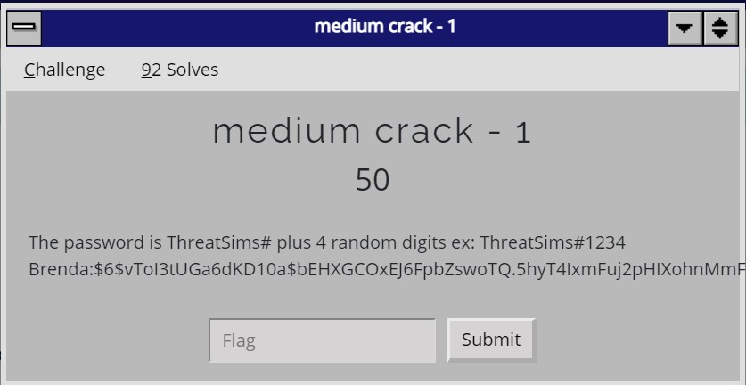

hashes to crack
```
* Brenda:$6$vToI3tUGa6dKD10a$bEHXGCOxEJ6FpbZswoTQ.5hyT4IxmFuj2pHIXohnMmFD1G5qH.pmyytZNYl.8s4eO.3k.xs8G3Y9m9UeV0hTn.
* Michael:$6$E18kQxa3w6QKasiA$HLyCjQjjKmBOmYmGHWih/5awDShCuISKufsQtXqfPuz4WrxbsUMNTnD2vQEpMLEBKHWPqE90EgK7V/Oz2hEh.1
* Patrick:$6$DplQDAkgZnkecaOf$53dhyz.PA/3SS0AARGYWhJrD.ciHgGaG/luK7D69MlLjT3wkoS97F3PZ5ZN43YPPTsHm1Ildq3GhFz9VOSudK.
* Charles:$6$r.cZ6iEVffJLWbzD$F1WcDCmmQRDgx5K8Ibhn/6IcxVRVzokgZ3ksjSXJEVTEuzadhWCEMqz1YyNxUdj8kuXnW2WMJisl0EM9ZRoL81
* Alexis:$6$bqsv1cKskrW1.DLe$hRmhlpA/5xwCeP4VtcXAD8nS10Px1epOckJ4W50FHiMe/WOnZri95NjFwZOKP5KgJOic3wkCTfZazPraqhZK2/
* Crystal:$6$jtqhNQ1fn7g55Ps6$065c/z7043XIPa5YUjTHVX0IYmGk6DL78HYzCqg/TVF1ipx0s7qi7aQ89nbx6ib1dboCm1jRwKqz7jznEnqgP.
* Larry:$6$0Bv9mltWNeG3n2SH$LwJmSAG2YzH17QyrS3CLxbGLHFpijnwcrNqWA290aPFeKW2VKWBH5d/6nbXkYCol6WE3FFG6dT6bB87jMXYe30
* Rhonda:$6$bbNS9rNLdYk/GzO8$S3g/o4poStUtRj8NBdYZPydqZ1O30cqckhaV3HKuTz4ZDBAMYwWFOSgexCHtfYgJeXIkc4mqPSKvOqJjicRZc0
* Jack:$6$XS5xk3OkPGeuNlp8$gid1.zbfOFlckxaLl/bzvluwZC61eiJ0XcfuecXeA7d.XXB60YxBLD/qvBJ15HLcm7i0KuUmmBpMQ9vZpKc2v1
* Claudia:$6$2N2VK97xK5o1tWUF$ysoka7.ubAPVM2NoauRR8mzgZ3wjGDekbmImb5AnNSUkomb0/Pl775LMyvyHEJSasXpt8koYUz0sOuvPRfllA0
```

**Solution:** 

Extract the hashes
```
* $6$vToI3tUGa6dKD10a$bEHXGCOxEJ6FpbZswoTQ.5hyT4IxmFuj2pHIXohnMmFD1G5qH.pmyytZNYl.8s4eO.3k.xs8G3Y9m9UeV0hTn.
* $6$E18kQxa3w6QKasiA$HLyCjQjjKmBOmYmGHWih/5awDShCuISKufsQtXqfPuz4WrxbsUMNTnD2vQEpMLEBKHWPqE90EgK7V/Oz2hEh.1
* $6$DplQDAkgZnkecaOf$53dhyz.PA/3SS0AARGYWhJrD.ciHgGaG/luK7D69MlLjT3wkoS97F3PZ5ZN43YPPTsHm1Ildq3GhFz9VOSudK.
* $6$r.cZ6iEVffJLWbzD$F1WcDCmmQRDgx5K8Ibhn/6IcxVRVzokgZ3ksjSXJEVTEuzadhWCEMqz1YyNxUdj8kuXnW2WMJisl0EM9ZRoL81
* $6$bqsv1cKskrW1.DLe$hRmhlpA/5xwCeP4VtcXAD8nS10Px1epOckJ4W50FHiMe/WOnZri95NjFwZOKP5KgJOic3wkCTfZazPraqhZK2/
* $6$jtqhNQ1fn7g55Ps6$065c/z7043XIPa5YUjTHVX0IYmGk6DL78HYzCqg/TVF1ipx0s7qi7aQ89nbx6ib1dboCm1jRwKqz7jznEnqgP.
* $6$0Bv9mltWNeG3n2SH$LwJmSAG2YzH17QyrS3CLxbGLHFpijnwcrNqWA290aPFeKW2VKWBH5d/6nbXkYCol6WE3FFG6dT6bB87jMXYe30
* $6$bbNS9rNLdYk/GzO8$S3g/o4poStUtRj8NBdYZPydqZ1O30cqckhaV3HKuTz4ZDBAMYwWFOSgexCHtfYgJeXIkc4mqPSKvOqJjicRZc0
* $6$XS5xk3OkPGeuNlp8$gid1.zbfOFlckxaLl/bzvluwZC61eiJ0XcfuecXeA7d.XXB60YxBLD/qvBJ15HLcm7i0KuUmmBpMQ9vZpKc2v1
* $6$2N2VK97xK5o1tWUF$ysoka7.ubAPVM2NoauRR8mzgZ3wjGDekbmImb5AnNSUkomb0/Pl775LMyvyHEJSasXpt8koYUz0sOuvPRfllA0
```

crack the hash using `hashcat.exe -m 1800 -a 3 hashes.txt -o found.txt "ThreatSims#?d?d?d?d"`

| hash  | result |
|-------|--------|
|`$6$vToI3tUGa6dKD10a$bEHXGCOxEJ6FpbZswoTQ.5hyT4IxmFuj2pHIXohnMmFD1G5qH.pmyytZNYl.8s4eO.3k.xs8G3Y9m9UeV0hTn.`|ThreatSims#7835|
|`$6$E18kQxa3w6QKasiA$HLyCjQjjKmBOmYmGHWih/5awDShCuISKufsQtXqfPuz4WrxbsUMNTnD2vQEpMLEBKHWPqE90EgK7V/Oz2hEh.1`|ThreatSims#4143|
|`$6$DplQDAkgZnkecaOf$53dhyz.PA/3SS0AARGYWhJrD.ciHgGaG/luK7D69MlLjT3wkoS97F3PZ5ZN43YPPTsHm1Ildq3GhFz9VOSudK.`|ThreatSims#1060|
|`$6$r.cZ6iEVffJLWbzD$F1WcDCmmQRDgx5K8Ibhn/6IcxVRVzokgZ3ksjSXJEVTEuzadhWCEMqz1YyNxUdj8kuXnW2WMJisl0EM9ZRoL81`|ThreatSims#2500|
|`$6$bqsv1cKskrW1.DLe$hRmhlpA/5xwCeP4VtcXAD8nS10Px1epOckJ4W50FHiMe/WOnZri95NjFwZOKP5KgJOic3wkCTfZazPraqhZK2/`|ThreatSims#9108|
|`$6$jtqhNQ1fn7g55Ps6$065c/z7043XIPa5YUjTHVX0IYmGk6DL78HYzCqg/TVF1ipx0s7qi7aQ89nbx6ib1dboCm1jRwKqz7jznEnqgP.`|ThreatSims#9735|
|`$6$0Bv9mltWNeG3n2SH$LwJmSAG2YzH17QyrS3CLxbGLHFpijnwcrNqWA290aPFeKW2VKWBH5d/6nbXkYCol6WE3FFG6dT6bB87jMXYe30`|ThreatSims#3757|
|`$6$bbNS9rNLdYk/GzO8$S3g/o4poStUtRj8NBdYZPydqZ1O30cqckhaV3HKuTz4ZDBAMYwWFOSgexCHtfYgJeXIkc4mqPSKvOqJjicRZc0`|ThreatSims#8944|
|`$6$XS5xk3OkPGeuNlp8$gid1.zbfOFlckxaLl/bzvluwZC61eiJ0XcfuecXeA7d.XXB60YxBLD/qvBJ15HLcm7i0KuUmmBpMQ9vZpKc2v1`|ThreatSims#6087|
|`$6$2N2VK97xK5o1tWUF$ysoka7.ubAPVM2NoauRR8mzgZ3wjGDekbmImb5AnNSUkomb0/Pl775LMyvyHEJSasXpt8koYUz0sOuvPRfllA0`|ThreatSims#5596|

Reference: https://cryptokait.com/2020/02/24/password-cracking-with-hashcat/

***
# FLAGUSB

## Look at What Wireshark Can Do!

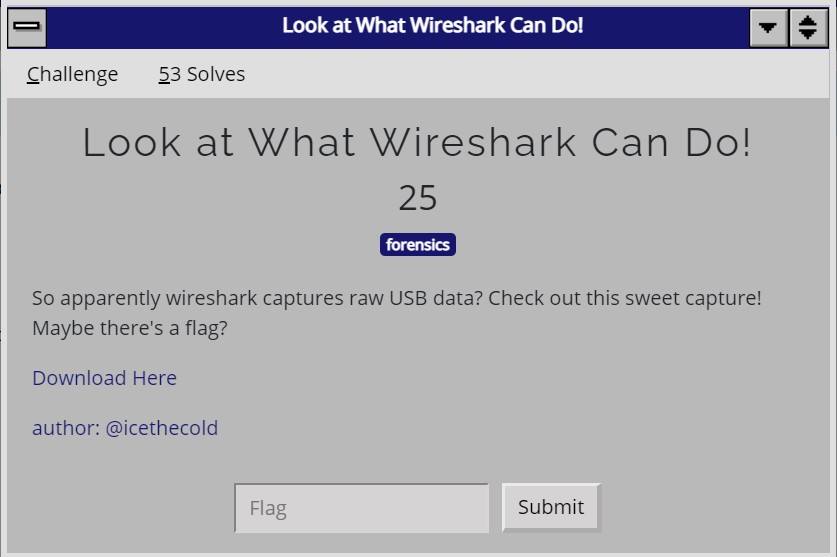

[challenge pcap](assets/usb/file.pcap)

**Solution:** 

Following https://abawazeeer.medium.com/kaizen-ctf-2018-reverse-engineer-usb-keystrok-from-pcap-file-2412351679f4 , use ((usb.transfer_type == 0x01) && (frame.len == 72)) && !(usb.capdata == 00:00:00:00:00:00:00:00) as the filter and extract the HID data

Using the script from https://blog.stayontarget.org/2019/03/decoding-mixed-case-usb-keystrokes-from.html and we can get the flag

***
# Quest

## Quest 1

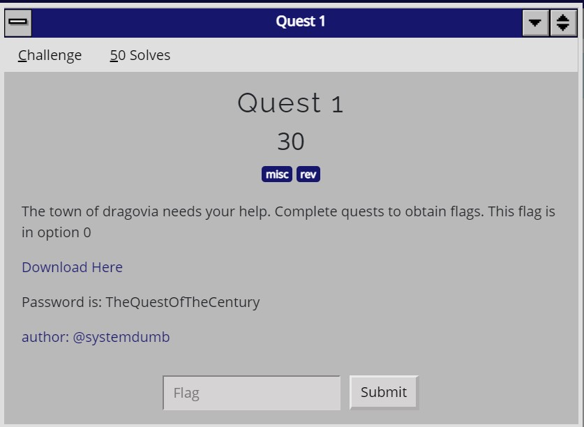
[quest.7z](assets/quest/quest.7z)
Password: TheQuestOfTheCentury

**{negat1v3en3rgy}**

**Solution:** 

Entering a large number such as `1111111111111111111111111` will output the flag

## Quest 2

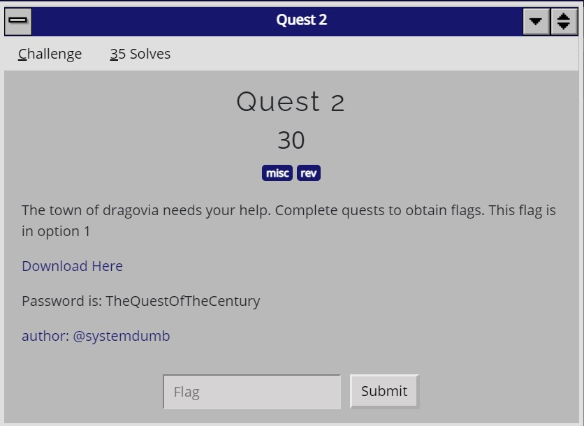
[quest.7z](assets/quest/quest.7z)
Password: TheQuestOfTheCentury

**{E11i0t_the_mastermind}**

**Solution:** 

Opening the file in ghidra, there's a function named `f2`, converting the values in f2 from hex to ascii gives the flag

***
# strings

## strings

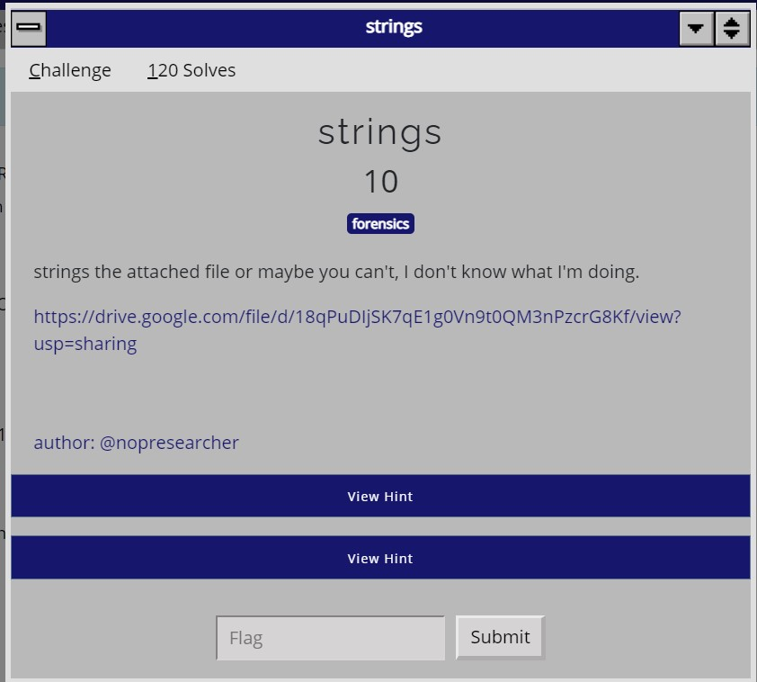

[strings.s](assets/strings/strings.s)

**ts{DidYoHuUseStriHngsorMatH}**

**Solution:** 

```
gcc -c strings.s -o strings.o
gcc strings.o -o strings
chmod +x strings
./strings

strings strings | less

...
ts{DidYoH
uUseStriH
ngsorMatH
...
```
***
***
# reversing

## Go get it

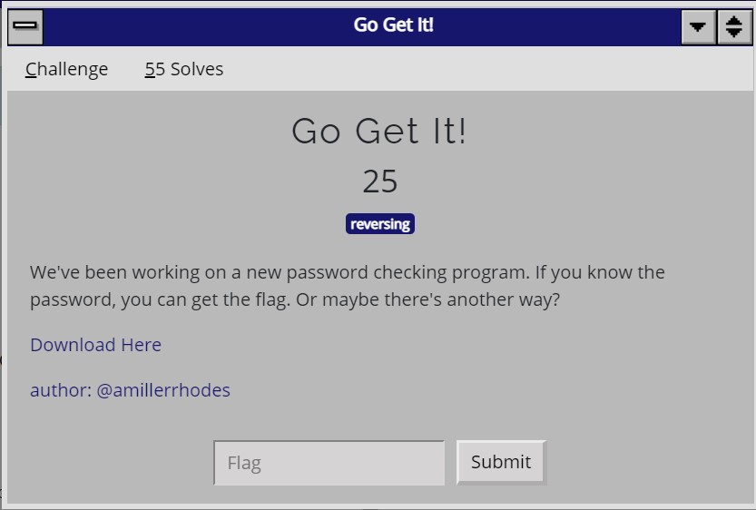
[Download here](assets/reversing/pwcheck)

**flag{go_go_gadget_github_key}**

**Solution:** 

Running the binary in ghidra, we can see that there's a github link 
https://github.com/fork-while-fork/ctfflag/blob/master/ctfflag.go

Going to the github link gives us some go code, running which we can get the flag
```
package main

import (
	"fmt"
)

func main() {
	pass := []byte{96, 47, 54, 54, 97, 47, 53, 51, 52, 100, 56, 51, 54, 47, 53, 51, 49, 50, 52, 53, 48, 48, 98, 98, 52, 53, 96, 96, 97, 97, 48, 55}
	flag := []byte{101, 107, 96, 102, 122, 102, 110, 94, 102, 110, 94, 102, 96, 99, 102, 100, 115, 94, 102, 104, 115, 103, 116, 97, 94, 106, 100, 120, 124}
	for i, c := range pass {
		pass[i] = c + 1
	}

	for i, c := range flag {
		flag[i] = c + 1
	}
	fmt.Println(string(pass))
	fmt.Println(string(flag))
}
```

***
# router-pwn 1 - 13

[Challenge pcap](assets/rtr-pwneip.pcap)

* Note: All challenges in this category use the same pcap
* All password hash cracking challenges can leverage rockyou.txt wordlist

| Question | Answer          |
|----------|-----------------|
|What is the hsrp password?| catch22$ |
|What is the hsrp group?| thebruceleeband |
|What is the hrsp virtual address?| 10.13.37.101 |
|What is the enable password?| reelbigfish |
|What is the enable secret?| lessthanjake12 |
|What is the plaintext password for zzyzzx?| mustardplug |
|What is the plaintext password for rayhan?| thespecials |
|What is the plaintext password for nopresearcher?| bosstones7 |
|What is the plaintext password for wald0?| maytals |
|What is the snmp community string with RO capability?| skatalites31 |
|An attacker brute forced the snmp community string to find the private string with RW capability, what is that snmp community string?| Madness |
|The attacker then changed the hostname of the router, what is the new hostname?| GOTREKT |
|What is the chassisSerialNumberString of this device?| 9MFFZXHAKZ4 |

Router Configuration can be found at udp.stream eq 16
plaintext password for wald0 can be found at tcp.stream eq 0

References & Tools
* https://www.m00nie.com/type-7-password-tool/
* https://www.infosecmatter.com/cisco-password-cracking-and-decrypting-guide/
* https://www.cisco.com/c/en/us/support/docs/switches/catalyst-6500-series-switches/41361-serial-41361.html

***

